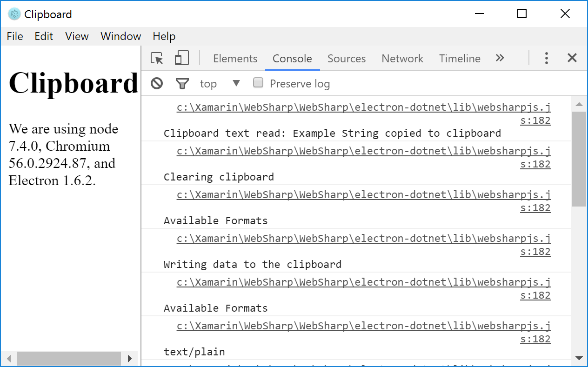
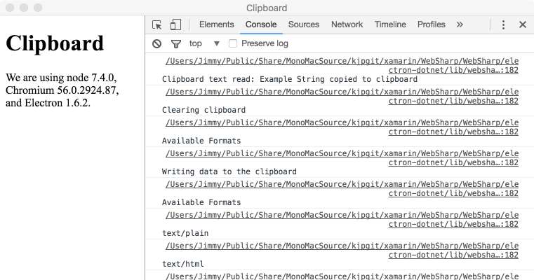

# clipboard README

Example of Electron&#39;s Clipboard 

Interacts with Electron&#39; Clipboard through C# to perform copy and paste operations on the system clipboard..

## Features

Perform copy and paste operations on the system clipboard.  Of note is that if there is an image on the clipboard when the application load it will be read from the clipboard and displayed in-line with the Html content.

Inside `Clipper.cs` you will find:

- Accessing the DOM using WebSharpJs.DOM name space.

    - Obtaining a reference to the underlying `HtmlDocument` using the static `HtmlPage` class.

    ``` cs
           document = await HtmlPage.GetDocument();
    ```
    - Using the `HtmlDocument` to obtain references to `HtmlElements` by their `id`
    ``` cs
            // Get a reference to the img element
            var imageElement = await document.GetElementById("image");
    ```
    - Setting `src` property on an `image` HtmlElement.

    ``` cs
            if (imageElement != null)
            {
                  // set the src property to the data string of the image/
                  await imageElement.SetProperty("src", await image.ToDataURL());
            }
    ```

Referencing the `Clipboard` instance.
- Sending and reading back information to/from the system clipbard.
- Querying information such as AvailableFormats.
- Clearing the clipboard.
- Bookmark information is sent and received using `Bookmark` class.
- Writing Data to the clipboard using ClipboardData class.





More information can be found in the [clipboard documentation](https://github.com/electron/electron/blob/master/docs/api/clipboard.md)

## Requirements

   * `electron-dotnet` needs to be built.  The easiest way is to use the provided `make` files available in the WebSharp base directory.  
   
      * [See Getting Started on Windows](https://github.com/xamarin/WebSharp/blob/master/docs/getting-started/getting-started-dev-windows.md)
   
      * [See Getting Started on Mac](https://github.com/xamarin/WebSharp/blob/master/docs/getting-started/getting-started-dev-mac.md)

> :bulb: Windows users need to make sure [Mono is available](https://github.com/xamarin/WebSharp/blob/master/docs/getting-started/getting-started-dev-windows.md#setting-mono-path) in their %PATH%.

## Known Issues


## Release Notes

### 1.0.1

Add `ReadImage` 

### 1.0.0

Initial release
