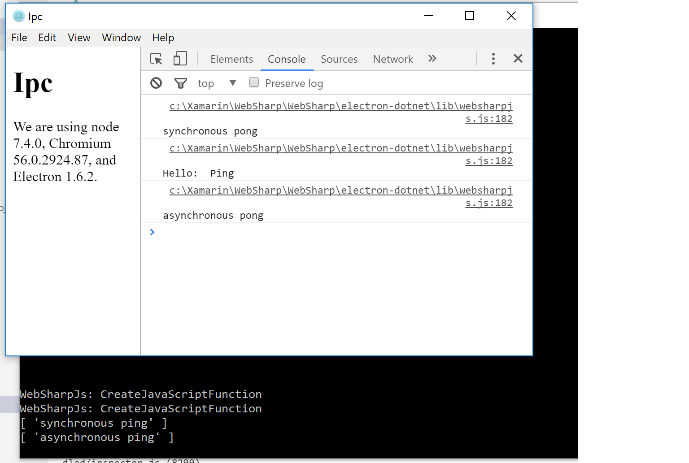
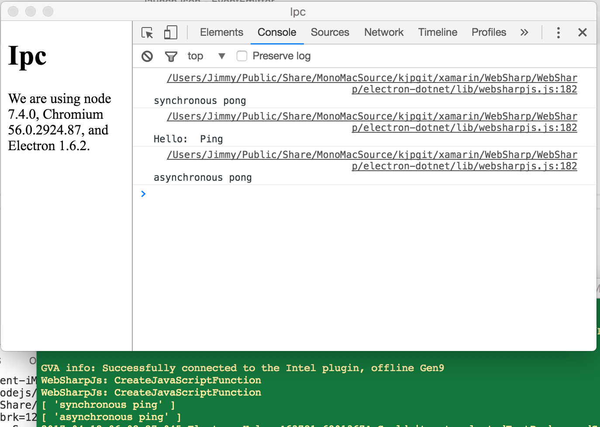

# ipc README

Example of IPC Communications between Renderer and Main Processes.

Communicate asynchronously from a renderer process to the main process.

## Features

The `IpcRenderer` module is an instance of the `EventEmitter` class. It provides a few methods so you can send synchronous and asynchronous messages from the render process (web page) to the main process. You can also receive replies from the main process.

Inside `Ping.cs` you will find:
- Creating an IpcRenderer object instance.
- Sending a synchronous message to the main process and logging the response.
- Waiting `On` a message.
- Receiving a message and logging the respons.

More information can be found in the [ipcRenderer documentation](https://github.com/electron/electron/blob/master/docs/api/ipc-renderer.md)

## Requirements

   * `electron-dotnet` needs to be built.  The easiest way is to use the provided `make` files available in the WebSharp base directory.  
   
      * [See Getting Started on Windows](https://github.com/xamarin/WebSharp/blob/master/docs/getting-started/getting-started-dev-windows.md)
   
      * [See Getting Started on Mac](https://github.com/xamarin/WebSharp/blob/master/docs/getting-started/getting-started-dev-mac.md)

> :bulb: Windows users need to make sure [Mono is available](https://github.com/xamarin/WebSharp/blob/master/docs/getting-started/getting-started-dev-windows.md#setting-mono-path) in their %PATH%.

## Known Issues

## Release Notes

### 1.0.0

Initial release

