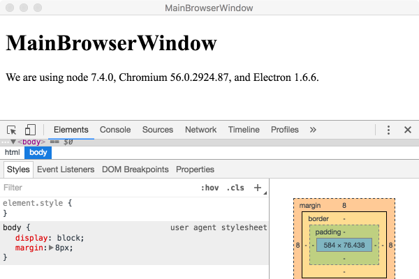

# mainbrowserwindow README

Example of creating a new BrowserWindow from the Main process.

This example will create the main `BrowserWindow` of the application from the Main process and then using the `WebContents` proceed to open the development tools docked to the bottom of the window.

## Features

Inside `MainWindow.cs` you will find:

- Creating and opening a `BrowserWindow`:

``` c-sharp
                // Create the browser window.
                mainWindow = await BrowserWindow.Create(new BrowserWindowOptions() {Width = 600, Height = 400});
```

> :bulb: The `BrowserWindowOptions` is strongly typed class of available options that is passed to the `BrowserWindow` on creation.  In this case it only specifies the `Width` and `Height` of the window.  For a list of the available bound options see the [browserwindow api documentation](https://github.com/electron/electron/blob/master/docs/api/browser-window.md#new-browserwindowoptions) 

- Loading the content into the `BrowserWindow` by using `LoadURL`:

``` c-sharp
                // and load the index.html of the app.
                await mainWindow.LoadURL($"file://{__dirname}/index.html");
```

The `__dirname` parameter is passed from `main.js` when calling this function.

- Opening the `DevTools`

``` c-sharp
               // Open the DevTools
                await mainWindow.GetWebContents().ContinueWith(
                        (t) => { t.Result?.OpenDevTools(DevToolsMode.Bottom); }
                );
```

By passing the `DevToolsMode` you can control the dock state of how the development tools are opened.  Defaults to last used dock state. In `Undocked` mode it's possible to dock back. In `Detach` mode it's not.
  Available DevToolsMode enumeration values are:

``` c-sharp
    public enum DevToolsMode
    {
        Right,
        Bottom,
        Undocked,
        Detach
    }
```

- The `BrowserWindow` is an `EventEmitter` so we can attach to specific events.

``` c-sharp
               // Emitted when the window is closed.
                await mainWindow.On("closed", async (evt) => 
                {
                    await console.Log("Received closed event");
                    System.Console.WriteLine("Received closed event");
                    mainWindow = null;
                    return null;
                });
```                

Setting up and calling the create method is done through the `main.js` javascript file that creates the application.

- We reference our `MainWindow` module.

``` js
    var mainbrowserwindow = require("./src/mainbrowserwindow.js");
```
The `mainbrowserwindow.js` exports `createMainWindow` function that we will use to call the `MainWindow` module. 

- In the `createwindow` function we call the exported `createMainWindow` function. 

``` js
function createWindow () {

  var windowId = mainbrowserwindow.createMainWindow(__dirname);

  if (windowId) console.log('Main Window Id: ' + result)

}

```




More information can be found in the [BrowserWindow documentation](https://github.com/electron/electron/blob/master/docs/api/browser-window.md#browserwindow)

## Requirements

   * `electron-dotnet` needs to be built.  The easiest way is to use the provided `make` files available in the WebSharp base directory.  
   
      * [See Getting Started on Windows](https://github.com/xamarin/WebSharp/blob/master/docs/getting-started/getting-started-dev-windows.md)
   
      * [See Getting Started on Mac](https://github.com/xamarin/WebSharp/blob/master/docs/getting-started/getting-started-dev-mac.md)

> :bulb: Windows users need to make sure [Mono is available](https://github.com/xamarin/WebSharp/blob/master/docs/getting-started/getting-started-dev-windows.md#setting-mono-path) in their %PATH%.

## Known Issues


## Release Notes

### 1.0.0

Initial release

