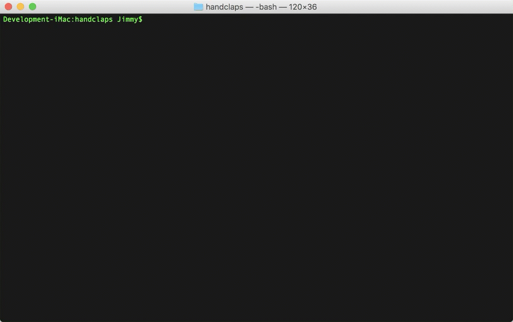
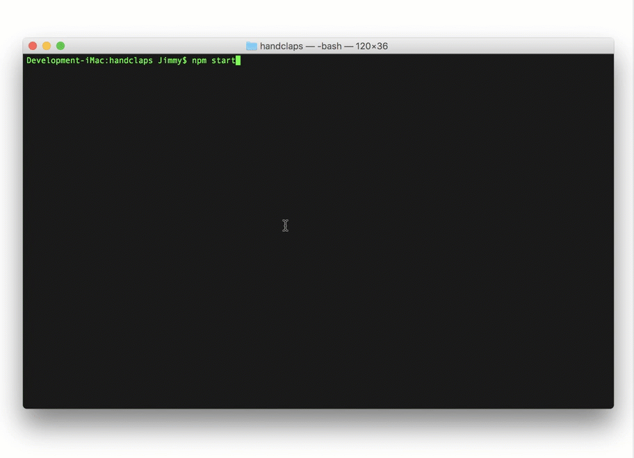

# handclaps README

Making generating handclap tweets easy.

More information can be found here [Handclaps web page](https://handclaps.io) and original source code can be found on [github](https://github.com/bojanrajkovic/handclaps)

## Features

### UI
- Bootstrap dependency used for UI. [source link](https://github.com/xamarin/WebSharp/blob/master/Examples/websharpjs/electron/handclaps/package.json#L15)

### Renderer

- C# DOM Event Handlers to handle `change` events. [source link](https://github.com/xamarin/WebSharp/blob/master/Examples/websharpjs/electron/handclaps/src/ClapsRenderer/ClapsRenderer.cs#L44-L46)
- C# DOM Event Handler to handle `click` event for copy button. [source link](https://github.com/xamarin/WebSharp/blob/master/Examples/websharpjs/electron/handclaps/src/ClapsRenderer/ClapsRenderer.cs#L47)
- Electron Clipboard interface handle copying to the clipboard. [source link](https://github.com/xamarin/WebSharp/blob/master/Examples/websharpjs/electron/handclaps/src/ClapsRenderer/ClapsRenderer.cs#L82-L86)
- Manipulating CSS Class Names to highlight the number of character counter when over 140 characters. [source link](https://github.com/xamarin/WebSharp/blob/master/Examples/websharpjs/electron/handclaps/src/ClapsRenderer/ClapsRenderer.cs#L88-L125)

### Main

- Use of `will-navigate` event from `WebContents` to capture all external link clicks and open them in the default browser instead of inline in our application. [source link](https://github.com/xamarin/WebSharp/blob/master/Examples/websharpjs/electron/handclaps/src/Main/MainWindow.cs#L42-L52)

## Requirements

   * `electron-dotnet` needs to be built.  The easiest way is to use the provided `make` files available in the WebSharp base directory.  
   
      * [See Getting Started on Windows](https://github.com/xamarin/WebSharp/blob/master/docs/getting-started/getting-started-dev-windows.md)
   
      * [See Getting Started on Mac](https://github.com/xamarin/WebSharp/blob/master/docs/getting-started/getting-started-dev-mac.md)

> :bulb: Windows users need to make sure [Mono is available](https://github.com/xamarin/WebSharp/blob/master/docs/getting-started/getting-started-dev-windows.md#setting-mono-path) in their %PATH%.

## Known Issues

## Release Notes

### 1.0.0

Initial release
