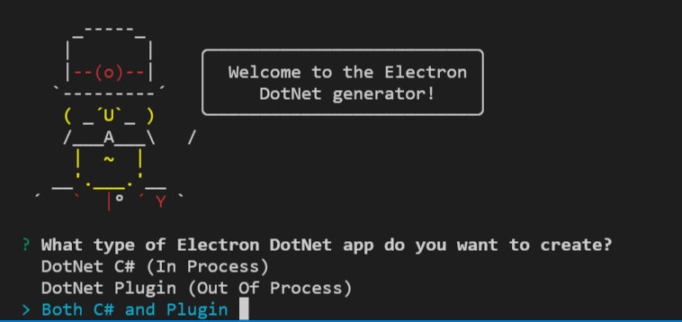
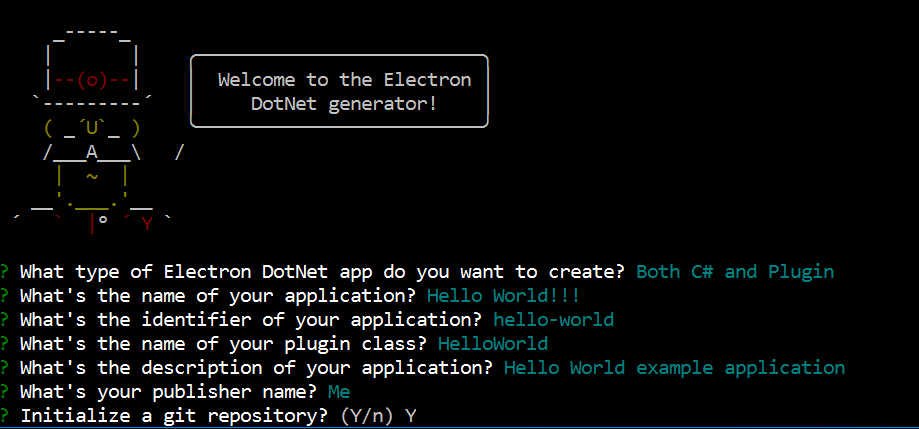
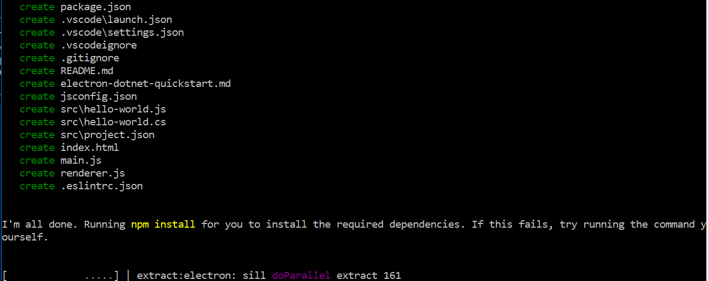
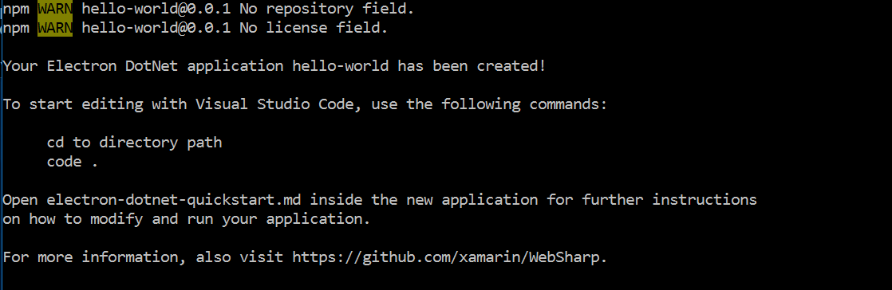

# Example Hello World

## Your First `Electron Dotnet` Application

This document will take you through creating your first `Electron Dotnet` application for VS Code ("Hello World") and will explain the basic `Electron` integration points to add C# code and Plugins to your `Electron` application.

In this walkthrough, you'll add a C# and a new Plugin to an Electron application which will display a simple "Hello" message from them both. Later in the walkthrough, you'll see how we can debug the different `Electron` processes, Main and Renderer.

## Prerequisites
You need [node.js](https://nodejs.org/en/) installed and available in your $PATH.
   * Plugins require [Mono](http://www.mono-project.com/download/) installed and available in your $PATH.
      
      > :bulb: Windows will need both the x86 and x64 bit versions installed and [available in your $PATH](https://github.com/xamarin/WebSharp/tree/master/electron-dotnet#setting-mono-path).
   * `electron-dotnet` needs to be built.  The easiest way is to use the provided `make` files available in the WebSharp base directory.
     ``` bash
     # Windows Visual Studio 2015 Command Line Prompt 
     nmake /f Makefile.win buildRelease
     ```

     ``` bash
     # Mac OSX terminal with XCode tools available for build.
     make setup  # only needs to be run the first time
     make build
     ```
     
## Getting Started      
  * Install [.NET Core.](https://www.microsoft.com/net/core)
  * Install the [C# extension from the VS Code Marketplace](https://marketplace.visualstudio.com/items?itemName=ms-vscode.csharp).

## Generate a `Electron Dotnet` Application
The simplest way to add a new `Electron DotNet` application for VS Code consumption is through adding a project. A project will have all the boot strap files available to run the `Electron` application.  For more details you can look at the [Electron Quick Start](https://github.com/electron/electron-quick-start).

We have written a Yeoman generator to help get you started. Install Yeoman and the Yeoman Electron Dotnet generator that provides different templates for creating new applications:

``` bash
npm install -g yo path-to-WebSharp-directory\Tools\generator-electron-dotnet
yo electron-dotnet
```
You will be presented with three different project types. For this example, we will pick `electron-dotnet.js: .NET and Node.js in-process with PepperPlugin`.  



Once the type of application project is selected the generator will present you with a series of questions so that the generator can generate the application for you.  Fill in the answers as shown in the following screen shot.



Hit enter to start generating the application structure.



This will install the dependencies automatically and when done you will have the application generated.



## The Structure of an application
After running, the generated application should have the following structure:

```
.
|--- .eslintrc.json
|--- .gitignore
|--- .vscode                           // VS Code integration
     |--- launch.json
     |--- settings.json
|--- .vscodeignore
|--- electron-dotnet-quickstart.md
|--- index.html                       // Html to be displayed in the app window
|--- jsconfig.json
|--- main.js                          // Defines the electron main process
|--- node_modules
     |--- All the node files used to run the electron application
|--- package.json                     // Various project metadata
|--- README.md
|--- renderer.js                      // Required in index.html and executed in the renderer process for that window 
|--- src                              // sources
     |--- hello-world.cs              // PepperPlugin implementation
     |--- hello-world.js              // C# code implementation
     |--- project.json                // Defines compilation information 

```

Let's go through the purpose of some of these files and explain what they do:

### The application manifest: package.json
The format of `package.json` is exactly the same as that of [Node’s modules](https://docs.npmjs.com/getting-started/using-a-package.json), and the script specified by the `main` field is the startup script of your app, which will run the main process.

* It serves as documentation for what packages your project depends on.
* It allows you to specify the versions of a package that your project can use using [semantic versioning rules](https://docs.npmjs.com/getting-started/semantic-versioning).
* Makes your build reproducable which means that its way easier to share with other developers.

``` json
{
    "name": "hello-world",
    "displayName": "Hello World!!!",
    "description": "Hello World example application",
    "version": "0.0.1",
    "publisher": "Me",
    "main": "main.js",
    "scripts": {
        "start": "electron ."
    },
    "devDependencies": {
        "electron": "^1.4.0"
    }
}
```

As you can see above the information that was filled in from the template questions has been placed in this file.

Electron is listed as one of the devDependencies and should have been installed when the template was created.  

A `start` script has already been defined in the `scripts` section that can easily be run as the target of a `npm run` command and is the default target for `npm start`.  In this case since we are creating an Electron application is set to run `electron .`.

### Start up script of our app: main.js

The `main.js` should create windows and handle system events.

``` js

// app is the Module to control application life.
// BrowserWindow is the Module to create native browser window.
const {app, BrowserWindow} = require('electron')

// Keep a global reference of the window object, if you don't, the window will
// be closed automatically when the JavaScript object is garbage collected.
var mainWindow = null;

// Register PepperPlugin API
require('electron-dotnet').Register();

function createWindow () {
  // Create the browser window.
  mainWindow = new BrowserWindow(
    {
      width: 600,
      height: 400,
      webPreferences: { plugins: true }
    }
  )

  // and load the index.html of the app.
  mainWindow.loadURL(`file://${__dirname}/index.html`)

  // Open the DevTools.
  //mainWindow.webContents.openDevTools()

  // Emitted when the window is closed.
  mainWindow.on('closed', function () {
    // Dereference the window object, usually you would store windows
    // in an array if your app supports multi windows, this is the time
    // when you should delete the corresponding element.
    mainWindow = null
  })
}

// This method will be called when Electron has finished
// initialization and is ready to create browser windows.
// Some APIs can only be used after this event occurs.
app.on('ready', createWindow)

// Quit when all windows are closed.
app.on('window-all-closed', function () {
  // On OS X it is common for applications and their menu bar
  // to stay active until the user quits explicitly with Cmd + Q
  if (process.platform !== 'darwin') {
    app.quit()
  }
})

app.on('activate', function () {
  // On OS X it's common to re-create a window in the app when the
  // dock icon is clicked and there are no other windows open.
  if (mainWindow === null) {
    createWindow()
  }
})

// In this file you can include the rest of your app's specific main process
// code. You can also put them in separate files and require them here.

```

The code above differs from a typical `main.js` example by adding additional functionality for a PepperPlugin [Native Client](https://developer.chrome.com/native-client) implementation.

``` js
// Register PepperPlugin API
require('electron-dotnet').Register();
```

The above code's `Register` method is delivered in the `electron-dotnet` Node.js implementation which will register the correct [Native Client](https://developer.chrome.com/native-client) implementation for the platform.  The registering of any Native Client needs to be done in the Electron Main process before any rendering code is executed.

The `Register` method is a wrapper around the following piece of code that will pass in command line switches before the application is actually started.

``` js
app.commandLine.appendSwitch('register-pepper-plugins', native-client-implementation + ';application/electron-dotnet');
``` 

One thing to notice in the above command line switch is `;application/electron-dotnet` that is appended to the native-client-implementation, which specifies the MIME type of the embedded content.  This is what tells the interface which Native Client implementation to load when an HTML `<embed></embed>` element is specified. 


The next piece of the puzzle to allow Native Client implementations to run is to tell the `BrowserWindow` that plugin api's need to be made available.

``` js
  mainWindow = new BrowserWindow(
    {
      width: 600,
      height: 400,
      webPreferences: { plugins: true }
    }
  )
``` 

The added `webPreferences` parameter passed to the `BrowserWindow` creation does just that.  Without this parameter access to the Native Client api's will fail.

> :bulb: If the `main` field is not present in `package.json`, Electron will attempt to load an `index.js`.

### Showing Information: index.html
The web page you want to show is defined in the static html file `index.html`.  This file is loaded from the `main.js` file referenced above in the `createWindow()` method.

``` js
 // and load the index.html of the app.
  mainWindow.loadURL(`file://${__dirname}/index.html`)
```

The static html file is just a normal file containing html elements that will be displayed in Electron's browser page.

``` html
<!DOCTYPE html>
<html>
  <head>
    <meta charset="UTF-8">
    <title>Hello World!!!</title>
  </head>
  <body>
    <h1>Hello World!!!</h1>
    <!-- All of the Node.js APIs are available in this renderer process. -->
    We are using node <script>document.write(process.versions.node)</script>,
    Chromium <script>document.write(process.versions.chrome)</script>,
    and Electron <script>document.write(process.versions.electron)</script>.
    <div id="pluginTarget" />
      <script>
        var pluginTarget = document.getElementById("pluginTarget");
        var moduleEl = require('electron-dotnet').Embed({
            name: 'plugin',
            id: 'plugin',
            width: 300,
            height: 200,
            src: 'HelloWorld.HelloWorld',
            path: "./src/bin/Debug/net451"
        });
        pluginTarget.appendChild(moduleEl);

      </script>
  </body>

  <script>
    // You can also require other files to run in this process
    require('./renderer.js')
  </script>
</html>

```

The interesting part of the file above is where we actually defined where our plugin will be displayed.

``` html

    <div id="pluginTarget" />
      <script>
        var pluginTarget = document.getElementById("pluginTarget");
        var moduleEl = require('electron-dotnet').Embed({
            name: 'plugin',
            id: 'plugin',
            width: 300,
            height: 200,
            src: 'HelloWorld.HelloWorld',
            path: "./src/bin/Debug/net451"
        });
        pluginTarget.appendChild(moduleEl);

      </script>
```

The above code's `Embed` method is delivered in the `electron-dotnet` Node.js implementation which will create an `<embed></embed>` element defining our PepperSharp [Native Client](https://developer.chrome.com/native-client) implementation.  

It is a convenience method to create an `<embed></embed>` tag that hosts a Module Instance implementation.

- height : The displayed height of the resource, in CSS pixels.
- src : The dot net class the implements the Module Instance that is embedded.
- path : The path where the assemblies can be found.
- width : The displayed width of the resource, in CSS pixels.

If you remember above when we mentioned the `Register()` method that there was a Mime type also appended automatically, this is where it needs to be referenced.  One extra attribute will be added to the `<embed>` element and that specifies the `type` attribute as `application/electron-dotnet`.  This is basically what the `Embed()` helper does. The same can be crafted by hand if need be with only this extra attribute added.  For example:

``` html
<embed name="plugin" id="plugin" width="300" height="200" src="HelloWorld.HelloWorld" type="application/electron-dotnet" path="C:\Xamarin\WebSharp\HelloWorld\src\bin\Debug\net451">
```

> :bulb: Knowing how to do the above may come in handy if you do not have access to Node.js by creating the `BrowserWindow` with `nodeIntegration: false`.

We will get into more detail about the `src` and `path` later on in the [Compiling plugin code](#compiling-plugin-code).

### Generated Code

The generated application's code is in the `src` directory.  Depending on the project template selected there is an implementation of each type of application integration point generated.  When we selected the `electron-dotnet.js: .NET and Node.js in-process with PepperPlugin` we will have a total of two src files:

``` bash
.
|--- src                              // sources
     |--- hello-world.cs              // PepperPlugin implementation
     |--- hello-world.js              // C# code implementation
     |--- project.json                // Defines compilation information 

```

#### PepperPlugin [Native Client](https://developer.chrome.com/native-client) implementation: hello_world.cs
The [Native Client](https://developer.chrome.com/native-client) implementation that will be loaded by the `require('electron-dotnet').Embed()` method mentioned above is outlined here:

``` csharp
using System;

using PepperSharp;

namespace HelloWorld
{
    public class HelloWorld : Instance
    {
        public HelloWorld (IntPtr handle) : base(handle)
        {
            Initialize += OnInitialize;
        }

        private void OnInitialize(object sender, InitializeEventArgs args)
        {
            LogToConsoleWithSource(PPLogLevel.Log, "HelloWorld.HelloWorld", "Hello from C#");
        }
    }
}
```

* Reference the PepperSharp assembly: 
    
    ``` csharp
    using PepperSharp;
    ```
* Class extends `Instance` of the PepperSharp implementation: 
    
    ``` csharp 
    public class HelloWorld : Instance
    ```
* Subscribes to the `Initialize` event:
   
    ``` csharp
    Initialize += OnInitialize;
    ```
   
   - This event is raised to initialize this instance with the provided `InitializeEventArgs` class object.
   - The `InitializeEventArgs` class object is `Cancelable`.
     - `InitializeEventArgs` Properties:
     
        | Type       | Name   | Description  |
        | ---------- |:-------|:------------ |
        | int        | Count  | Gets the number of arguments |
        | string[]   | Names  | Gets the argument names  |
        | string[]   | Values | Gets the argument values  |
        | bool       | Cancel | Gets or sets a value indicating whether the event should be canceled. |
      
* Output to the Console:
    ``` csharp
    LogToConsoleWithSource(PPLogLevel.Log, "HelloWorld.HelloWorld", "Hello from C#");
    ```


### Miscellaneous files
* .vscode/launch.json - Defines Debugger launching targets. 
* .vscode/settings.json - Place your settings in this file to overwrite default and user settings, by default specifies the typescript server. If you are receiving a *TypeScript tsserver error* you can install this into your project's local node_modules by exectuing `npm i typescript`.
* .gitignore - Tells Git version control which patterns to ignore.
* README.md - README file describing your application.
* electron-dotnet-quickstart.md - A Quick Start guide for you.
* .eslintrc.json - Configuring ESLint

## Compiling plugin code
Before running our application we will need to compile our plugin code ```hello-world.cs```.

The compile target uses [Dotnet Core](https://www.microsoft.com/net/core) with one of the dependencies of the Plugin API `Xamarin.PepperSharp` delivered as a NuGet package.

``` bash
# Windows
cd src
HelloWorld\src> dotnet restore -s path-to-WebSharp\electron-dotnet\tools\build\nuget
HelloWorld\src> dotnet build
HelloWorld\src> dotnet publish
cd ..
```

``` bash
# Mac OSX
cd src
HelloWorld\src$ dotnet restore -s path-to-WebSharp/electron-dotnet/tools/build/nuget
HelloWorld\src$ dotnet build
HelloWorld\src$ dotnet publish
cd ..
```

### What do the commands above do?

* Resolve the build assets by typing `dotnet restore`.
  * Running `restore` pulls down the required packages declared in the project.json file.
  * You'll see a new project.lock.json file in your project folder.
  * This file contains information about your project's dependencies to make subsequent restores quicker.
  * The `-s path-to-WebSharp/electron-dotnet/tools/build/nuget` in the `restore` is the nuget source where the `Xamarin.PepperSharp.xxx.nupkg` can be found.
     * On Windows if a Local Package source is setup then the source will be search so you will not need to provide this parameter.
     * On Mac it seems that the `restore` does not work for Local Package sources right now.  Your mileage may vary but this is the surefire way to get the dependencies restored correctly.
  * The `Xamarin.PepperSharp.xxxx.nupkg` dependency is built during the Electron DotNet build process.
* Build the source `hello-world.cs` implementation by typing `dotnet build`.
  * The `build` command will compile the source file based on the definition found in the `project.json`
* Make the assemblies available for use by typing `dotnet publish`.
  * This will copy the implementation as well as the `Xamarin.PepperSharp.dll` from the nuget package available to be loaded.
  * The `PepperPlugin` does not support loading from a nuget package so the `publish` will make all the dependencies available in one place so they can be loaded.

## Running the application

To run the application we will need to install 'electron-dotnet' module which provides all of the ```Node.js``` implemenation for running within ```Electron```.

> :bulb: This project dependency will be automatic in the future once the project workflow has been defined and will be installed with the template in the future.

But right now we will have to do this install manually from the command line.

``` bash
# Windows
HelloWorld> npm install path-to-WebSharp\electron-dotnet   
HelloWorld> npm start 
```

> :bulb: Windows users need to make sure that mono is [available in their $PATH](https://github.com/xamarin/WebSharp/tree/master/electron-dotnet#setting-mono-path).  If not then a runtime error is generated.


``` bash
# Mac OSX
HelloWorld$ npm install path-to-WebSharp/electron-dotnet   
HelloWorld$ npm start 
```


