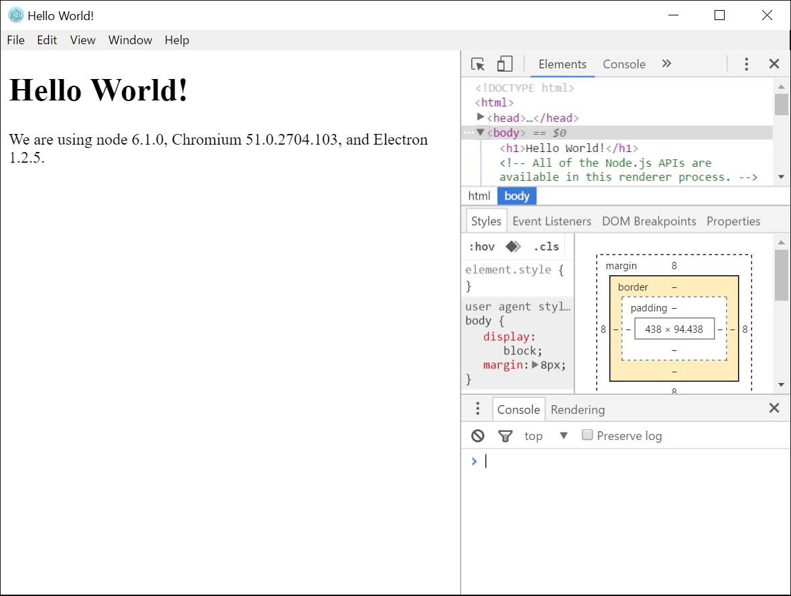
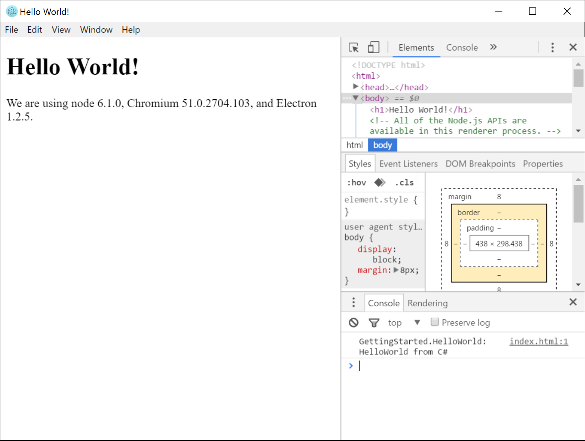

Notice
======

This workflow is just a temporary workflow while we get the effort bootstrapped, it will likely take a very
different shape in the future.   While currently this references binaries, we will be adding a source-code
mode with Roslyn, where we automatically compile the code on demand.

This is just a workflow that is being used during development.   We are open to suggestions on how to improve
this.

Getting Started
===============

Electron offers a Quick Start on their site: http://electron.atom.io/docs/tutorial/quick-start/ that explains how to get started.

Pre-requisites
---
- node.js can be found here - https://nodejs.org/
- Electron - From a command prompt ```> npm install electron-prebuilt```.  This will install the electron prebuilt which is required to run the plugins that you develop.  You can also install globally with the ```-g``` parameter. *Note on mac you may need to use ```> sudo npm install electron-prebuilt``` and enter you password when prompted and hit enter.*
- Visual Studio 2015 minimum Community edition
- Make sure the PepperPlugin has been built.  https://github.com/xamarin/WebSharp/blob/master/PepperPlugin/readme.md


Install Electron
===

Change to directory ```WebSharp\GettingStarted>```

```shell
# Install dependencies and run the app
$ npm install && npm start
```

The above commands will install Electron and start the project.  You should see the following screen when after the previous command.
If not make sure you have Node.js installed.




Building the GettingStarted example
===

Before you can embed a plugin we will first have to build the modules.

Build the `GettingStarted.sln`.   You can use either Visual Studio/Xamarin Studio, or `xbuild`/`msbuild` from the command line.

```shell
# Windows from Visual Studio 2015 command prompt
$ msbuild GettingStarted.sln
```

```shell
# Mac terminal
$ xbuild GettingStarted.sln
```


Installing 'electron-dotnet' Node.js module
===

The Electron plugin is delivered as a Node.js module and needs to be installed.  *Note: We will be installing the module from a local directory for now.*

For Windows
```shell
$ npm install ../electron-dotnet/
```

For Mac
```shell
$ sudo npm install ../electron-dotnet
```

This will install electron-dotnet as a module and allow us to do ```require('electron-dotnet').Register()``` which registers the correct PepperPlugin assembly for the platform and architecture that is used by Electron.


Registering the plugin
===

Before you can embed any .net code you will first have to register the plugin with Electron.

Open the ```main.js``` file which you can find the GettingStarted directory in your favorite text editor and uncomment, remove the two slashes '//' from the beginning of line 11 that reads:

```javascript
//require('electron-dotnet').Register();
```

Will then become:

```javascript
require('electron-dotnet').Register();
```

*Note: Make sure you save the file.*


Embedding classes
===

All the .dll assemblies we want to load will be embedded using ```<embed></embed>```.  So lets load our .Net assembly.

Open the file named ```index.html``` and scroll down to see the code for the body.  We will be embedding our plugin instance here.

Add the following code inside the ```<body>``` tag of the html.

```html
      <div id="pluginTarget" />
      <script>
        var pluginTarget = document.getElementById("pluginTarget");
        var moduleEl = require('electron-dotnet').Embed({
            name: 'plugin',
            id: 'plugin',
            width: 300,
            height: 200,
            src: 'GettingStarted.HelloWorld',
            path: "./bin/Debug"
        });
        pluginTarget.appendChild(moduleEl);

      </script>
```

The electron-dotnet's Embed method is a helper to create an ```<embed>``` tag that hosts a Module Instance implementation.

- height : The displayed height of the resource, in CSS pixels.
- src : The dot net class the implements the Module Instance that is embedded.
- path : The path where the assemblies can be found.
- width : The displayed width of the resource, in CSS pixels.

Now we can startup the application again with ```npm start``` and in the console you should see:

```
GettingStarted.HelloWorld: HelloWorld from C#
```


Note: On Windows
---
If there is an error about 'plugin can not be loaded' make sure that you have compiled the correct platform version (x86/x64) of the PepperPlugin that matches the Electron platform architecture that was installed above.
