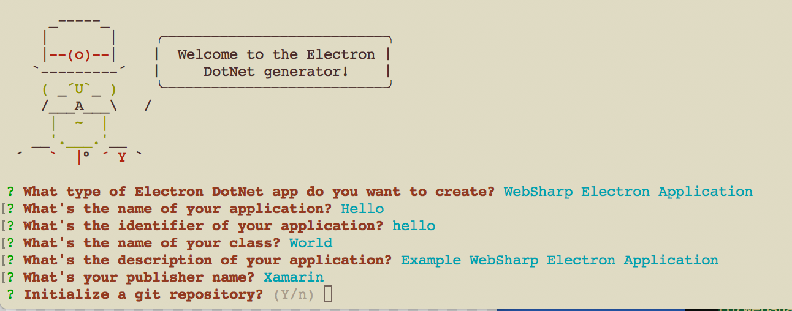
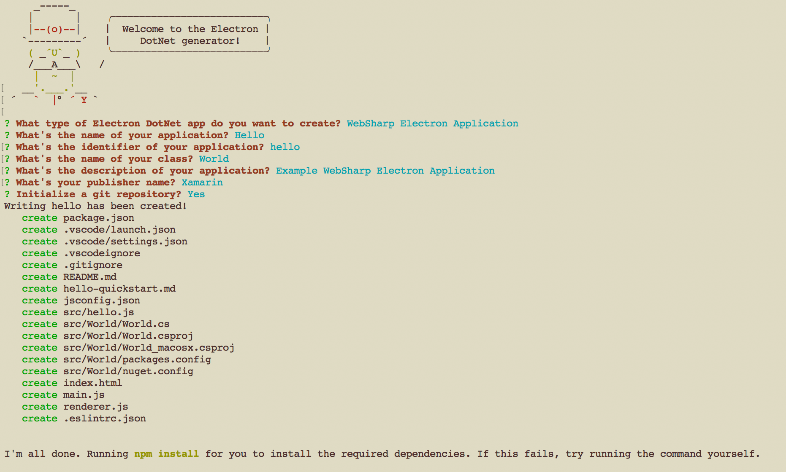
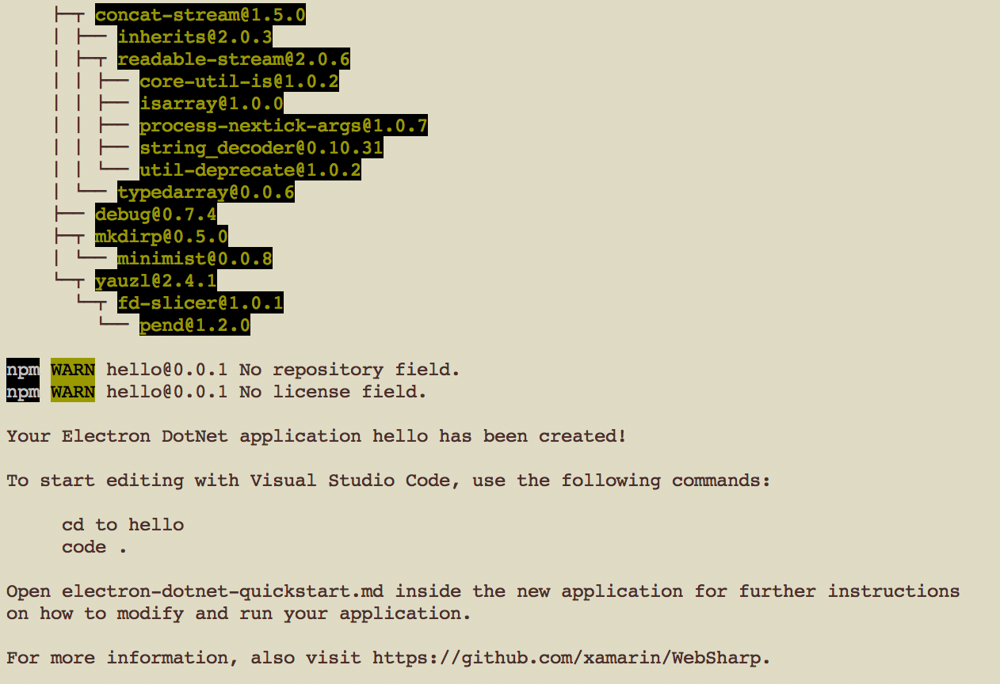
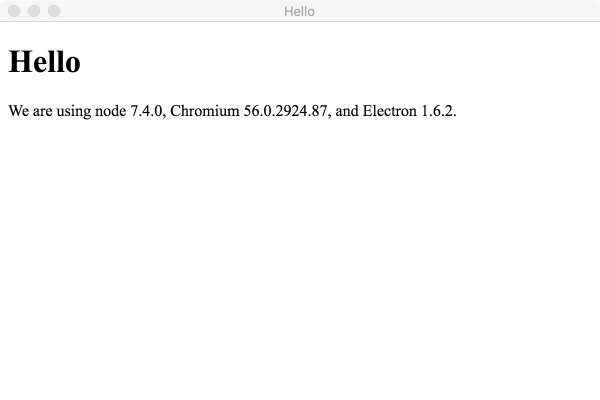
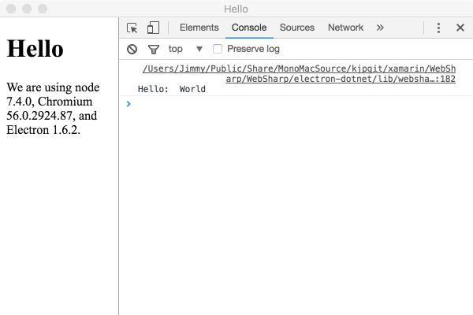

# Getting Started Websharp Electron Application

## Hello World Application

This document will take you through creating an `WebSharp Electron` application ("Hello").

In this walkthrough, you'll begin with setting up a basic `WebSharp Electron` application.  The C# application that is generated from the template accepts a string from JavaScript, formats the string and will then log the formatted message to the console `Hello: World`.

## Prerequisites
You need [node.js](https://nodejs.org/en/) installed and available in your $PATH.
   * Plugins will not be used in this example.

   * `electron-dotnet` needs to be built.  The easiest way is to use the provided `make` files available in the WebSharp base directory.  
   
      * [See Getting Started on Windows](https://github.com/xamarin/WebSharp/blob/master/docs/getting-started/getting-started-dev-windows.md)
   
      * [See Getting Started on Mac](https://github.com/xamarin/WebSharp/blob/master/docs/getting-started/getting-started-dev-mac.md)

## Create an application directory

First thing to do is create a directory for the new application.

```powershell

# Windows command line

C:\projects> mkdir hello
C:\projects> cd hello
C:\projects\hello> _

```

```bash
# Mac terminal

/projects$ mkdir hello
/projects$ cd hello
/projects/hello$ _

```

## Generate a `WebSharp Electron` Application
The simplest way to add a new `WebSharp Electron` application for consumption is through adding a project. A project will have all the boot strap files available to run the `Electron` application.  For more details you can look at the [Electron Quick Start](https://github.com/electron/electron-quick-start).

We have written a [Yeoman generator](./../../Tools/generator-electron-dotnet/README.md) to help get you started. Install Yeoman and the Yeoman Electron Dotnet generator that provides different templates for creating new applications:

``` bash
npm install -g yo path-to-WebSharp-directory\Tools\generator-electron-dotnet
yo electron-dotnet
```
You will be presented with different project types. For this example, we will pick `WebSharp Electron Application`.  


Once the type of application project is selected the generator will present you with a series of questions so that the generator can generate the application for you.  Fill in the answers as shown in the following screen shot.



Hit enter to start generating the application structure.



This will install the dependencies automatically and when done you will have the application generated.



## Referencing WebSharp's `electron-dotnet`

During the install process of the application `Electron` should already be installed but you will also need to reference `electron-dotnet` as well.

WebSharp is going through development and is still in transition so unfortunately no npm package exists yet so will need to be referenced from a local build.

There are two ways:

* Symlink

```bash
npm link electron-dotnet # link-install the `electron-dotnet` package
```

* npm install

```bash
npm install --save path-to-WebSharp/electron-dotnet/      # install 'electron-dotnet'
```

For a list of pros and cons take a look at the following from the `Getting Started` documentation listed in the prerequisites at the beginning of this document:

* [Referencing `electron-dotnet` on Windows](https://github.com/xamarin/WebSharp/blob/master/docs/getting-started/getting-started-dev-windows.md#referencing-electron-dotnet)
   
* [Referencing `electron-dotnet` on Mac](https://github.com/xamarin/WebSharp/blob/master/docs/getting-started/getting-started-dev-mac.md#referencing-electron-dotnet)


## The Structure of an application
After running, the generated application should have the following structure:

```
.
|--- .eslintrc.json
|--- .gitignore
|--- .vscode                           // VS Code integration
     |--- launch.json                  // Launch Configurations
     |--- settings.json
|--- .vscodeignore
|--- hello-quickstart.md        // The document you are reading now
|--- index.html                       // Html to be displayed in the app window
|--- jsconfig.json
|--- main.js                          // Defines the electron main process
|--- node_modules
     |--- All the node files used to run the electron application
|--- package.json                     // Various project metadata
|--- README.md
|--- renderer.js                      // Required in index.html and executed in the renderer process for that window 
|--- src                              // sources
     |--- hello.js                    // javascript code implementation
     |--- Main                             
          |--- nuget.config                 // Configuring NuGet behavior
          |--- packages.config              // Used to track installed packages
          |--- MainWindow.cs                // Controls the applications main event lifecycle via managed code
          |--- MainWindow.csproj            // Project          
          |--- MainWindow.sln               // Solution
     |--- World
          |--- nuget.config           // Configuring NuGet behavior
          |--- packages.config        // Used to track installed packages
          |--- World.cs               // Application Implementation
          |--- World.csproj           // Project          
          |--- World.sln              // Solution          
     |--- Build.sln                         // Global project build solution
```

Let's go through the purpose of some of these files and explain what they do:

### The application manifest: package.json
The format of `package.json` is exactly the same as that of [Node’s modules](https://docs.npmjs.com/getting-started/using-a-package.json), and the script specified by the `main` field is the startup script of your app, which will run the main process.

* It serves as documentation for what packages your project depends on.
* It allows you to specify the versions of a package that your project can use using [semantic versioning rules](https://docs.npmjs.com/getting-started/semantic-versioning).
* Makes your build reproducable which means that its way easier to share with other developers.

``` json
{
    "name": "hello",
    "displayName": "Hello",
    "description": "Example WebSharp Electron Application",
    "version": "0.0.1",
    "publisher": "Xamarin",
    "main": "main.js",
    "scripts": {
        "start": "electron ."
    },
    "devDependencies": {
        "electron": "^1.4.0"
    }
}
```

As you can see above the information that was filled in from the template questions have been placed in this file.

Electron is listed as one of the devDependencies and should have been installed when the template was created.  

A `start` script has already been defined in the `scripts` section that can easily be run as the target of a `npm run` command and is the default target for `npm start`.  In this case since we are creating an Electron application is set to run `electron .`.

### Start up script of our app: main.js

The `main.js` should create windows and handle system events.

``` js
// app is the Module to control application life.
// BrowserWindow is the Module to create native browser window.
const {app, BrowserWindow} = require('electron')

// Keep a global reference of the window object, if you don't, the window will
// be closed automatically when the JavaScript object is garbage collected.
var mainWindow = null;

var dotnet = require('electron-dotnet');
//var main = dotnet.func(__dirname + "/src/Main/bin/Debug/MainWindow.dll");
var main = dotnet.func(__dirname + "/src/Main/MainWindow.cs");

function createWindow () {
    main(__dirname, function (error, result) {
        if (error) throw error;
        if (result) {
            mainWindow = BrowserWindow.fromId(result);
            // Emitted when the window is closed.
            mainWindow.on('closed', function () {
              // Dereference the window object, usually you would store windows
              // in an array if your app supports multi windows, this is the time
              // when you should delete the corresponding element.
              mainWindow = null
            })
            
        }
      });
}

// This method will be called when Electron has finished
// initialization and is ready to create browser windows.
// Some APIs can only be used after this event occurs.
app.on('ready', createWindow)

// Quit when all windows are closed.
app.on('window-all-closed', function () {
  // On OS X it is common for applications and their menu bar
  // to stay active until the user quits explicitly with Cmd + Q
  if (process.platform !== 'darwin') {
    app.quit()
  }
})

app.on('activate', function () {
  // On OS X it's common to re-create a window in the app when the
  // dock icon is clicked and there are no other windows open.
  if (mainWindow === null) {
    createWindow()
  }
})

// In this file you can include the rest of your app's specific main process
// code. You can also put them in separate files and require them here.

```

### Showing Information: index.html
The web page you want to show is defined in the static html file `index.html`.  This file is loaded from the `main.js` file referenced above in the `createWindow()` method.

``` js
 // and load the index.html of the app.
  mainWindow.loadURL(`file://${__dirname}/index.html`)
```

The static html file is just a normal file containing html elements that will be displayed in Electron's browser page.

``` html
<!DOCTYPE html>
<html>
  <head>
    <meta charset="UTF-8">
    <title>Hello</title>
  </head>
  <body>
    <h1>Hello</h1>
    <!-- All of the Node.js APIs are available in this renderer process. -->
    We are using node <script>document.write(process.versions.node)</script>,
    Chromium <script>document.write(process.versions.chrome)</script>,
    and Electron <script>document.write(process.versions.electron)</script>.
  </body>

  <script>
    // You can also require other files to run in this process
    require('./renderer.js')
  </script>
</html>

```

### Renderer Process: renderer.js

Since Electron uses Chromium for displaying web pages, Chromium’s multi-process architecture is also used. Each web page in Electron runs in its own process, which is called the renderer process.

In normal browsers, web pages usually run in a sandboxed environment and are not allowed access to native resources. Electron users, however, have the power to use Node.js APIs in web pages allowing lower level operating system interactions.

``` js
// This file is required by the index.html file and will
// be executed in the renderer process for that window.
// All of the Node.js APIs are available in this process.
var hello = require("./src/hello.js");

hello.sayHello();
```

We require the electron-dotnet .js generated file `"./src/hello.js"` which is the .NET and Node.js in-process implementation. To print out the `Hello: World` message we will execute the exported method from that file `sayHello` which displays the message to the console.

When we get to debugging you will see why it is broken up this way.

> :bulb: We will not be going into the differences of Electron's Main and Renderer processes but for more informaiton you can start [here](http://electron.atom.io/docs/tutorial/quick-start/#differences-between-main-process-and-renderer-process) 


### Generated Code

The generated application's code is in the `src` directory.  Depending on the project template selected there is an implementation of each type of application integration point generated.  When we selected the `WebSharp Electron Application` option we will have a total of one src file:

```
.
|--- src                              // sources
     |--- hello.js                    // javascript code implementation
     |--- Main                             
          |--- nuget.config                 // Configuring NuGet behavior
          |--- packages.config              // Used to track installed packages
          |--- MainWindow.cs                // Controls the applications main event lifecycle via managed code
          |--- MainWindow.csproj            // Project          
          |--- MainWindow.sln               // Solution
     |--- World
          |--- nuget.config           // Configuring NuGet behavior
          |--- packages.config        // Used to track installed packages
          |--- World.cs               // Application Implementation
          |--- World.csproj           // Project          
          |--- World.sln              // Solution          
     |--- Build.sln                         // Global project build solution

```

#### WebSharp: .NET and Node.js in-process implementation: hello.js

``` js
var dotnet = require('electron-dotnet');

//var hello = dotnet.func(__dirname + "/World/bin/Debug/World.dll");
var hello = dotnet.func(__dirname + "/World/World.cs");

//Make method externaly visible this will be referenced in the renderer.js file
exports.sayHello = arg => {
	hello('World', function (error, result) {
		if (error) throw error;
		if (result) console.log(result);
	});
}
```

The first line enables scripting C# from Node.js.

The next two lines creates a C# `hello` function for us.  By default the first line is commented out with the second line specifying the source code file of the generated class.  This will compile the `.cs` module on the fly.  The commented out first line can be used if on the fly compiling is not desirable allowing a generated assembly of the source to be specified.  More info about [Building Assemblies](https://github.com/xamarin/WebSharp/blob/master/docs/getting-started/getting-started-websharp-building-assemblies.md).

> :bulb: Note the use of the variable `__dirname` that is prepended to the paths.  This is useful if you are going to packageing your app or the packaged app may not be able to find your sources or assemblies.   

The provided `func` accepts a reference to C# code and returns a `Node.js` function which acts as a JavaScript proxy to the Func<object,Task<object>> .NET delegate

For more detailed information about scripting C# from a Node.js process please reference the [How to: integrate C# code into Node.js code](
https://github.com/xamarin/WebSharp/tree/master/electron-dotnet#how-to-integrate-c-code-into-nodejs-code
) section of the documentation.

What we do need to point out is the code:

``` js
//Make method externaly visible this will be referenced in the renderer.js file
exports.sayHello = arg => {
	hello('World', function (error, result) {
		if (error) throw error;
		if (result) console.log(result);
	});
}
``` 

We will be referencing this code from Electron's Renderer process which can be found in the [`renderer.js` file mentioned above](#renderer-process-rendererjs). To do this we will export a function called `sayHello` so that it can be referenced in other processes.

At the bottom of our [index.html](#showing-information-indexhtml) we require `renderer.js` which loads this file into Electrons's [Renderer](http://electron.atom.io/docs/tutorial/quick-start/#renderer-process) process.  

``` js
  <script>
    // You can also require other files to run in this process
    require('./renderer.js')
  </script>
```

#### WebSharp: .NET implementation: World.cs

The generator also created a directory with the same name as the class, `World`, that was supplied in the template definition questions.  The layout of the subdirectory is shown here.

```
|--- src                              // sources
     |--- World
          |--- nuget.config           // Configuring NuGet behavior
          |--- packages.config        // Used to track installed packages
          |--- World.cs               // Application Implementation
          |--- World.csproj           // Project 
          |--- World.sln              // Solution

```

This directory contains additional files to help in creating an assembly for the different platforms.  We will go into more detail about these files and their uses in the section [Building Websharp Electron Application Assemblies](https://github.com/xamarin/WebSharp/blob/master/docs/getting-started/getting-started-websharp-building-assemblies.md) but for now lets just focus on the `World.cs` source file.

The .Net implementation `World.cs` is executed from the exported `sayHello` function mentioned above. 

``` cs
using System;
using System.Threading.Tasks;

using WebSharpJs.NodeJS;

//namespace World
//{
    public class Startup
    {

        static WebSharpJs.NodeJS.Console console;

        /// <summary>
        /// Default entry into managed code.
        /// </summary>
        /// <param name="input"></param>
        /// <returns></returns>
        public async Task<object> Invoke(object input)
        {
            if (console == null)
                console = await WebSharpJs.NodeJS.Console.Instance();

            try
            {
                await console.Log($"Hello:  {input}");
            }
            catch (Exception exc) { await console.Log($"extension exception:  {exc.Message}"); }

            return null;


        }
    }
//}

```

Let's now take a look at the code.

- Using section

    Add a reference to the `WebSharpJs` assembly.

    ``` cs
    using System;
    using System.Threading.Tasks;

    using WebSharpJs.NodeJs;
    ```

    The `WebSharpJs` assembly provides the interaction with `Nodejs`.  In this example we will be using the `Console` object from the `NodeJS` namespace to log our message to the console. 

- Class `World` implementation

``` cs
    //namespace World
    //{
        public class Startup
        {

            static WebSharpJs.NodeJS.Console console;

            /// <summary>
            /// Default entry into managed code.
            /// </summary>
            /// <param name="input"></param>
            /// <returns></returns>
            public async Task<object> Invoke(object input)
            {
                if (console == null)
                    console = await WebSharpJs.NodeJS.Console.Instance();

                try
                {
                    await console.Log($"Hello:  {input}");
                }
                catch (Exception exc) { await console.Log($"extension exception:  {exc.Message}"); }

                return null;


            }
        }
    //}

```
    
By default the `namespace` is commented out.  The reason for this that we use on the fly compiling and by convention, the class must be named `Startup` and it must have an `Invoke` method that matches the `Func<object,Task<object>>` delegate signature.

> :bulb: When you specify C# source code this way the `WebSharp.js` assembly is automatically made available during the compile so there is no need to specify a reference to the assembly. 

The code creates a reference to the `NodeJS` `Console` instance that defines the console logging functions.

The next lines will format the string passed and log it to the console, `Hello:  World` in this case.

Any exceptions will be logged to the console in the `catch` block.

If you prefer to pre-compile your C# sources to a CLR assembly, or if your C# component is already pre-compiled, you can reference a CLR assembly from your Node.js code.  See the next section [Building Websharp Electron Application Assemblies](https://github.com/xamarin/WebSharp/blob/master/docs/getting-started/getting-started-websharp-building-assemblies.md) for more information.

### How to: integrate C# code into Node.js code

`electron-dotnet` provides several ways to integrate C# code into a `Node.js` application. Regardless of the way you choose, the entry point into the `.NET` code is normalized to a `Func<object,Task<object>>` delegate. This allows `Node.js` code to call `.NET` asynchronously and avoid blocking the `Node.js` event loop. 

`electron-dotnet` provides a function that accepts a reference to C# code in one of the supported representations, and returns a `Node.js` function which acts as a JavaScript proxy to the `Func<object,Task<object>>` `.NET` delegate:

```javascript
var dotnet = require('electron-dotnet');

var myFunction = dotnet.func(...);
```

The function proxy can then be called from `Node.js` like any asynchronous function:

```javascript
myFunction('Some input', function (error, result) {
    //...
});
```

Alternatively, if you know the C# implementation will complete synchronously given the circumstances, you can call this function as any synchronous JavaScript function as follows:

```javascript
var result = myFunction('Some input', true);
```

The `true` parameter instead of a callback indicates that `Node.js` expects the C# implementation to complete synchronously. If the CLR function implementation does not complete synchronously, the call above will result in an exception. 

One representation of CLR code that `electon-dot.js` accepts is C# source code. You can embed C# literal representing a `.NET` async lambda expression implementing the `Func<object,Task<object>>` delegate directly inside `Node.js` code:

```javascript
var add7 = dotnet.func('async (input) => { return (int)input + 7; }');
``` 

In another representation, you can embed multi-line C# source code by providing a function with a body containing a multi-line comment. `electron-dotnet` extracts the C# code from the function body using regular expressions:

```javascript
var add7 = dotnet.func(function() {/*
    async (input) => {
        return (int)input + 7;
    }
*/});
```

Or if you use ES6 you can use [template strings](https://developer.mozilla.org/de/docs/Web/JavaScript/Reference/template_strings) to define a multiline string:

```javascript
var add7 = dotnet.func(`
    async (input) => {
        return (int)input + 7;
    }
`);
```

We could just as easily have provided the `World.cs` class implementation as a `function` with a `body` contained within a multi-line comment as follows.

```
var hello = dotnet.func(function() {/*

using System;
using System.Threading.Tasks;

using WebSharpJs.NodeJS;

public class Startup
{

    static WebSharpJs.NodeJS.Console console;

    /// <summary>
    /// Default entry into managed code.
    /// </summary>
    /// <param name="input"></param>
    /// <returns></returns>
    public async Task<object> Invoke(object input)
    {
        if (console == null)
            console = await WebSharpJs.NodeJS.Console.Instance();

        try
        {
            await console.Log($"Hello:  {input}");
        }
        catch (Exception exc) { await console.Log($"extension exception:  {exc.Message}"); }

        return null;


    }
}

*/})

```

This would replace the `var hello = dotnet.func("./src/World/World.cs");` definition in the `hello.js` file.

Just remember that when using on the fly compile option that the class must be named `Startup` and it must have an `Invoke` method that matches the `Func<object,Task<object>>` delegate signature

### Miscellaneous files
* .vscode/launch.json - [Defines Debugger launching targets](./vsc-debug.md). 
* .vscode/settings.json - Place your settings in this file to overwrite default and user settings, by default specifies the typescript server. If you are receiving a *TypeScript tsserver error* you can install this into your project's local node_modules by exectuing `npm i typescript`.
* .gitignore - Tells Git version control which patterns to ignore.
* README.md - README file describing your application.
* hello-quickstart.md - A Quick Start guide for you with basic information about the generated project.
* .eslintrc.json - Configuring ESLint

## Running the application

To run the application we will need to reference the `electron-dotnet` module which provides all of the ```Node.js``` implementation for running within ```Electron```.

> :bulb: This project dependency will be automatic in the future once the project workflow has been defined and will be installed with the template in the future.

But right now we will have to manually reference `electron-dotnet` from the command line.

### Referencing electron-dotnet

See the relevent information in the documents below:

* [Windows](https://github.com/xamarin/WebSharp/blob/master/docs/getting-started/getting-started-dev-windows.md#referencing-electron-dotnet)

* [Mac](https://github.com/xamarin/WebSharp/blob/master/docs/getting-started/getting-started-dev-mac.md#referencing-electron-dotnet)

After setting up the reference, do the following from the command line.

``` bash
# Windows
> npm start 
```

``` bash
# Mac OSX
$ npm start 
```

## Hello

You should be presented with the following screen:



The `World.cs` program writes output to the Console.  To see this you can select `View` -> `Toggle Developer Tools` which will show the console of the Developer Tools.



## Summary

In this document we have looked at creating a project and the layout of the application structure.  

We also touched breifly on the purpose of the most important files.  Then moved on to referencing the `electron-dotnet` node module that provides the bridge between JavaScript and managed code. 

By default the application compiles the `World.cs` code on the fly, which may not be the best scenario depending on the application.  Just remember that when specifying source code that the class must be named `Startup` and it must have an `Invoke` method that matches the `Func<object,Task<object>>` delegate signature.

There are several ways to integrate C# code 

To finish off we then ran the electron application and saw that it was possible to reference the console log from managed code.

If you prefer to pre-compile your C# sources to a CLR assembly then the section on [Building Assemblies](https://github.com/xamarin/WebSharp/blob/master/docs/getting-started/getting-started-websharp-building-assemblies.md) will interest you.
