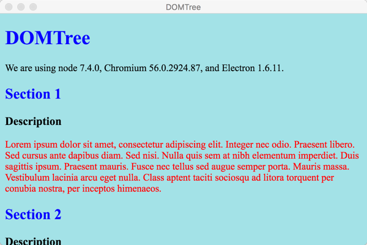
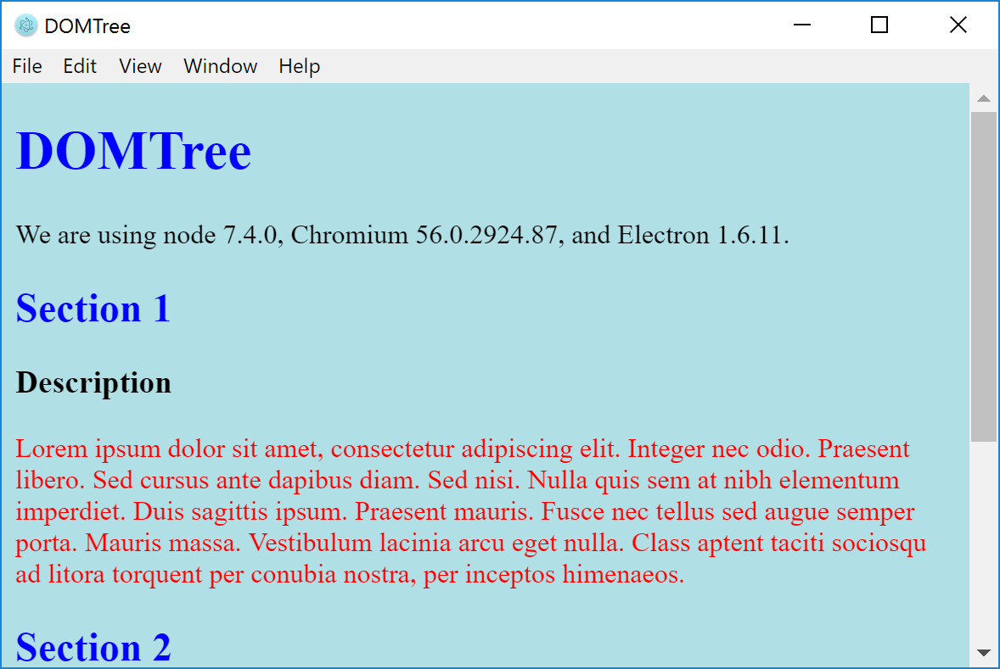

# Tinkering with HTML DOM Elements

Example of tinkering with HTML DOM Elements

## Features

* [HTML 5 Imports specs](http://w3c.github.io/webcomponents/spec/imports/)

* Other reference links
  - [WebComponents.org introduction](https://www.webcomponents.org/community/articles/introduction-to-html-imports)
  - [html5rocks.com tutorial](https://www.html5rocks.com/en/tutorials/webcomponents/imports/)
  - [teamtreehouse.com introduction](http://blog.teamtreehouse.com/introduction-html-imports)

* Mac

* Windows

More information can be found in the [DOM Overview](../overview.md#htmlpage-gateway-to-dom)

## Requirements

   * `electron-dotnet` needs to be built.  The easiest way is to use the provided `make` files available in the WebSharp base directory.  
   
      * [See Getting Started on Windows](https://github.com/xamarin/WebSharp/blob/master/docs/getting-started/getting-started-dev-windows.md)
   
      * [See Getting Started on Mac](https://github.com/xamarin/WebSharp/blob/master/docs/getting-started/getting-started-dev-mac.md)

> :bulb: Windows users need to make sure [Mono is available](https://github.com/xamarin/WebSharp/blob/master/docs/getting-started/getting-started-dev-windows.md#setting-mono-path) in their %PATH%.

## Known Issues
