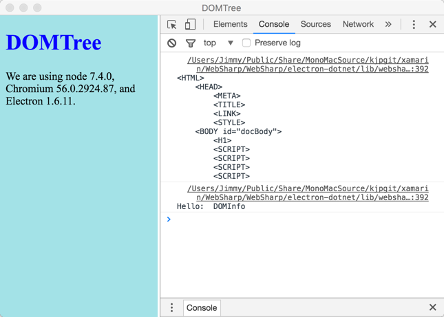
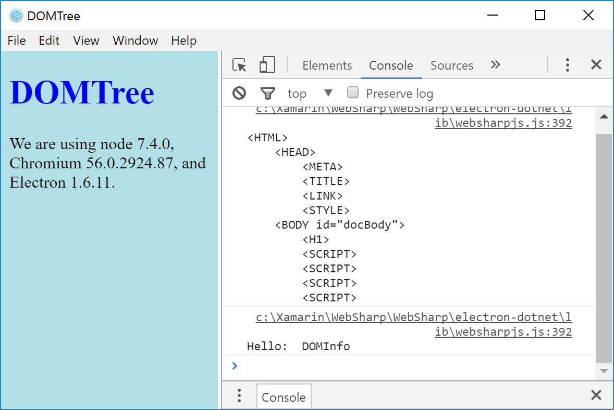

# HTMLDocument DOM Traversal

Shows the traversal of the page DOM document.

## Features

* Mac

* Windows

More information can be found in the [DOM Overview](../overview.md#htmlpage-gateway-to-dom)

The code is based on an example from [Pro Silverligh 5 in CSharp](https://github.com/Apress/pro-silverlight-5-in-csharp/blob/master/Pro%20Silverlight/Chapter17/BrowserInteraction/DissectPage.xaml.cs)

## Requirements

   * `electron-dotnet` needs to be built.  The easiest way is to use the provided `make` files available in the WebSharp base directory.  
   
      * [See Getting Started on Windows](https://github.com/xamarin/WebSharp/blob/master/docs/getting-started/getting-started-dev-windows.md)
   
      * [See Getting Started on Mac](https://github.com/xamarin/WebSharp/blob/master/docs/getting-started/getting-started-dev-mac.md)

> :bulb: Windows users need to make sure [Mono is available](https://github.com/xamarin/WebSharp/blob/master/docs/getting-started/getting-started-dev-windows.md#setting-mono-path) in their %PATH%.

## Known Issues
