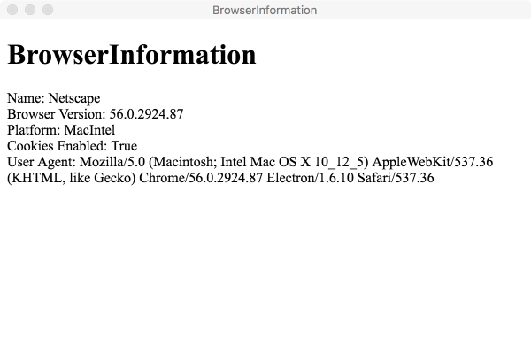
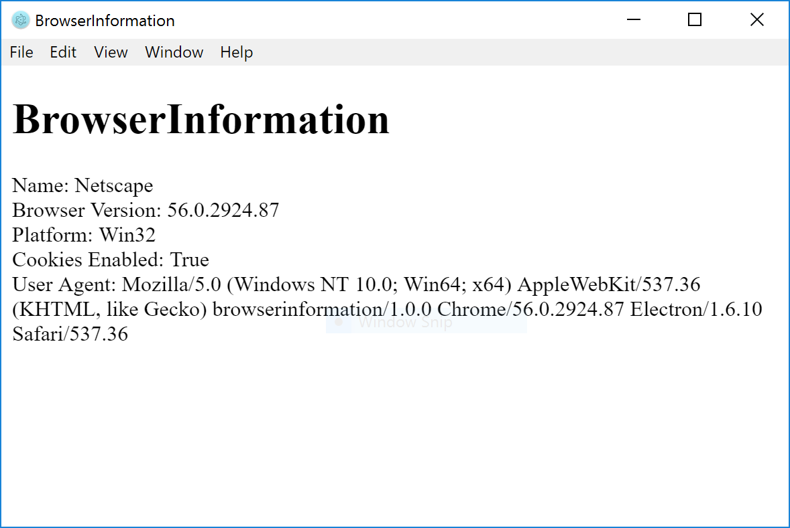

# DOM Overview

When you create a [WebSharp Electron Application](https://github.com/xamarin/WebSharp/blob/master/docs/getting-started/getting-started-websharp-electron-application.md) the `WebSharp.js.dll` assembly that is installed with `electron-dotnet` provides the bridge between `Node.js`, `Electron` and the managed code that is written.  This same assembly provides access to the HTML page's DOM elements.  A developer can take advantage of this assembly to access the DOM elements via the `WebSharpJs.Script` and `WebSharpJs.DOM` namespaces.  

Use the `GetHtmlDocument` method of the `HtmlPage` object to obtain a reference to the HTML page's Document Object Model (DOM).  Those that are familiar with `Silverlight`'s browser integration via `System.Windows.Browser` namespace should be able to get up and running fast as the API footprint is very close.

There are some differences though because of the different integration technoligies, `SilverLight` uses a plugin whereas `WebSharp` uses `Native Modules` as an interface, which affects the implementation details a little.  One of the main differences is `WebSharp`'s asynchronous only interface.

Besides the differences the developer will still work with managed objects in their code.  These objects are managed via the `WebSharp.js` assembly and can be passed back and forth between managed code and `Node.js/Electron`.

## Content

&nbsp;&nbsp;&nbsp;&nbsp;[Key Classes](#the-key-classes-of-the-websharpjsdom-namespace)  
&nbsp;&nbsp;&nbsp;&nbsp;[HTML Page](#html-page-gateway-to-dom)  
&nbsp;&nbsp;&nbsp;&nbsp;&nbsp;&nbsp;&nbsp;&nbsp;[BrowserInformation](#browserinformation)  
&nbsp;&nbsp;&nbsp;&nbsp;&nbsp;&nbsp;&nbsp;&nbsp;[HTML Window](#html-window)  
&nbsp;&nbsp;&nbsp;&nbsp;&nbsp;&nbsp;&nbsp;&nbsp;&nbsp;&nbsp;&nbsp;&nbsp;[Interaction with script code](#interaction-with-script-code)  
&nbsp;&nbsp;&nbsp;&nbsp;&nbsp;&nbsp;&nbsp;&nbsp;[HTML Document](#html-document)  

## The key classes of the WebSharpJs.DOM namespace

| Class | Description |
| --- | --- |
| HtmlPage | Represents the current HTML page.  It is the gateway to the browser's DOM via the `GetDocument` method (`HtmDocument`), which in turn allows the developer to access HTML elements (`HtmlElement`).  It also allows interacting with the browser window (`HtmlWindow` via `Electron`'s BrowserWindowProxy managed object) and obtain information about the environment the application is running within (`BrowserInformation`). | 
| BrowserInformation | Obtains name, version, and operating system of the web browser |
| HtmlDocument | Used to access the HTML DOM from managed code and represents the complete HTML Document that is loaded into the browser at the time.  Usually `HtmlElement` objects are queried for and obtained from this object. | 
| HtmlElement | Represents an HTML element in the page DOM.  There exists a full range of manipulation methods to interact with an `HtmlElement`  | 
| HtmlWindow | Represents an `Electron` window object in managed code via `Electron`'s BrowserWindowProxy.  Notice that this is not a normal `JavaScript` window as `Electron` intercepts the object and provides their own implementation.  For instance the `Prompt` method of the this object will fail as `Electron` does not provide an implementation at this time nor will they as per the documentation.   |
| HttpUtility | Provides static methods for encoding and decoding HTML and URL strings. |

## HTML Page: Gateway to DOM

The static `HtmlPage` class is where one begins to access the DOM.  From the page object you then have access to the following methods.

| Class | How To |
| --- | --- |
| HtmlDocument | var document = await HtmlPage.GetDocument(); |
| HtmlWindow | var window = await HtmlPage.GetWindow() |
| BrowserInformation | var info = await HtmlPage.GetBrowserInformation() |

### BrowserInformation

So for example we want to get the `BrowserInformation` we would have the following:

```cs
    var info = await HtmlPage.GetBrowserInformation();
   
    var infoText = $"Name: {info.Name}<br />Browser Version: {info.BrowserVersion}<br />Platform: {info.Platform}<br />Cookies Enabled: {info.CookiesEnabled}<br />User Agent: {info.UserAgent}";

    // other code following to update the DOM to display the infoText in the page.
```

* Mac



* Windows



See the [BrowserInformation source code](./browserinfo)


### HTML Window

The Html Window provides very limited access to the window.  Most of the time using the `BrowserWindow` objects of `Electron` will be more desirable.  `Electron` actually intercepts some of the functionality to provide their own implementation (See [BrowserWindowProxy](https://github.com/electron/electron/blob/master/docs/api/browser-window-proxy.md)) or throw an error as for `Prompt`. 

To obtain a reference to the `HtmlWindow` object use the following.

```cs
    var win = await HtmlPage.GetWindow();
```

Let's briefly look at the functionality of the `HtmlWindow` object.

| Method | Description |
| --- | --- |
| Alert | Displays a dialog box that contains an application-defined message. | 
| Confirm | Displays a confirmation dialog box that contains an optional message as well as OK and Cancel buttons.  This method will return a `true\false` value.  This method will also block the UI so be careful. | 
| Eval | Evaluates a string that contains arbitrary JavaScript code. | 
| Prompt | This method will actually throw an error `prompt() is and will not be supported.`  Use `Electron`'s `Dialog` objects. | 

#### Interaction with script code

One interesting function that one can do with the `HtmlWindow` object is interacting with code that is defined in the page.

Start by defining a `<script>` within the `<head>` section of of the page's html.

```html

  <head>
    <meta charset="UTF-8">
    <title>Hello</title>

    <script type="text/javascript">
        function SayHello(text) {
            var helloElement = document.getElementById("hello");
            helloElement.innerHTML = 'Hello: ' + text;
        }
    </script>

  </head>

```

The above code starts by searching for an element with a name of `hello` so define a `<p>` element somewhere in the `<body>` section of the page's html.

```html
    <p id="hello"></p>
```

The function will then update the `innerHTML` of that element with the text that is passed in.

Now from your managed code you can call this function by using the `Invoke` method of the `HtmlWindow` object.

```cs
            var win = await HtmlPage.GetWindow();
            await win.Invoke<object>("SayHello", " from HtmlWindow.");
```

If all is defined correctly you should see the `Hello: from HtmlWindow.` text displayed on your screen.

### HTML Document

The document object represents your web page.

If you want to access any element in an HTML page, you always start with accessing the document object.

| Method | Description |
| --- | --- |
| CreateElement | Creates a new HtmlElement object to represent a dynamically created HTML element, which you can then insert into the page.  | 
| GetBody | Gets an HtmlElement object that represents the `<body>` element in the HTML page. | 
| GetDocumentUri | Gets a Uniform Resource Identifier (URI) object. | 
| GetDocumentElement | Gets a reference to the browser's DOCUMENT element. | 
| GetElementById | Gets a single browser element.  | 
| GetElementsByTagName | Gets a collection of browser elements.  | 
| GetLocation | Returns a Location object, which contains information about the URL of the document.  | 
| GetIsReady | Gets a value that indicates whether the browser has completely loaded the HTML page. | 
| GetReadyState | Gets the string value that indicates the state of the the HTML page. | 
| QuerySelector | Returns the first Element within the document that matches the specified CSS selector, or group of CSS selectors.  | 
| QuerySelectorAll | Returns a collection Elements within the document that matches the specified CSS selector, or group of CSS selectors.  | 
| Submit | Submits the page, by posting a form and its data back to the server.  | 

The `HTMLDocument` object allows you to traverse the `HTMLElement`s of the document.

The example [domtree](./domtree) shows an example of traversing the page DOM using the `HTMLDocument` class.

* Mac


* Windows


The source code for creating the above can be found in the sources [domtree sources](./domtree/src/DOMInfo/DOMInfo.cs)

```cs


        var document = await HtmlPage.GetDocument();
        // Get a reference to the top-level <html> element.
        var element = await document.GetDocumentElement();
        // Process the starting element reference
        await ProcessElement(element, 0);

```

The actual traversal takes place in the `ProcessElement` method.

```cs

        private async Task ProcessElement(HtmlElement element, int indent)
        {
            // Ignore comments.
            if (await element.GetTagName() == "!") return;
            
            // Indent the element to help show different levels of nesting.
            elementTree += new String(' ', indent * 4);

            // Display the tag name.
            elementTree += "<" + await element.GetTagName();
            
            // Only show the id attribute if it's set.
            if (await element.GetId() != "") elementTree += " id=\"" + await element.GetId() + "\"";
            elementTree += ">\n";

            // Process all the elements nested inside the current element.
            foreach (var childElement in await element.GetChildren())
            {
                await ProcessElement(childElement, indent + 1);
            }
        }

``` 

### HTML Element

When traversing the DOM as described above each element that is traversed is a `HtmlElement` obtained by using the `GetChildren()` method of the element.  Other methods available from the `HtmlElement` can be found below.

| Method | Description |
| --- | --- |
| AppendChild | Appends a child element to the current HTML element's child collection.  Use `HtmlDocument.CreateElement` to create a new element. |
| AttachEventHandler | Adds a raised `JavaScript` event to managed code `EventHandler` |
| DetachEventHandler | Removes a managed code `EventHandler` attached to a raised `JavaScript` event. |
| Focus | Gives focus to the current element to receive events. |
| GetAttribute | Retrieves a named attribute on the current element.  |
| GetCssClass | Retrieves the CSS class name on the current element. |
| GetProperty | Retrieves a named property on the current element.  Example:  `await element.GetProperty<string>("innerHtml")`.   |
| GetStyleAttribute | Retrieves a named CSS style attribute on the current element. |
| Invoke | Invokes a method on the current element.  Example: `await element.Invoke<object>("blur")` that will remove the focus from the current element. |
| QuerySelector | Returns the first Element within the document that matches the specified CSS selector, or group of CSS selectors.  | 
| QuerySelectorAll | Returns a collection Elements within the document that matches the specified CSS selector, or group of CSS selectors.  | 
| RemoveAttribute | Removes a named attribute on the current element.  |
| RemoveStyleAttribute | Removes a named CSS style attribute on the current element. |
| SetAttribute | Sets a named attribute value on the current element.  |
| SetCssClass | Sets the CSS class name on the current element. |
| SetProperty | Sets the value a named property on the current element.  Example:  `await element.SetProperty("innerHtml", "Hello")`.  |
| SetStyleAttribute | Sets a named CSS style attribute value on the current element.  |

  