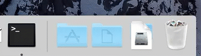
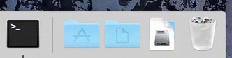

# Setting Application Icon - Mac and Windows

This short tutorial will focus on setting the application icon for both Mac and Windows during development.  Packaging the application and including the application icon will not be covered here.


[Create a new `WebSharp Electron Application`](https://github.com/xamarin/WebSharp/blob/master/docs/getting-started/getting-started-websharp-electron-application.md#generate-a-websharp-electron-application) and open it in you favorite source editor.

## Windows

Setting the application icon on windows is pretty straight forward.

When creating your main application's `BrowserWindow` it accepts a `BrowserWindowOptions` object that is passed to the `Create` method.  

The `BrowserWindowOptions` object provides two optional properties that will allow the developer to set the application icon.

| Property | Description |
| --- | --- |
| `string` IconPath | Accepts a path string to the image file to be used as the application icon. |
| `NativeImage` IconImage | Accepts an instance of a `NativeImage` object that will be used as the application icon. |


Open the `src\Main\MainWindow.cs` file and look for the `CreateWindow` method.

```cs
        
        async Task<int> CreateWindow (string __dirname)
        {
            // Create the browser window.
            mainWindow = await BrowserWindow.Create(
                new BrowserWindowOptions() { 
                    Width = 600, 
                    Height = 400,
                    IconPath = $"{__dirname}/resources/appicon.ico"
                }
            );

            // rest of the implementation left out

        }

```
 
> :bulb: On Windows it is recommended to use `ICO` icons to get best visual effects.

In the example code above we used the `IconPath` property, specifying the path and name string, instead of a `NativeImage` set on the `IconImage` property.  Either can be specified as the functionality is the same.

```cs

    IconPath = $"{__dirname}/resources/appicon.ico"

```

When the application is started the icon that is specified will show up the window's `TaskBar`.

## Mac 

Unfortunately if the icon is set in the `BrowserWindow`'s `Create` method, as decribed above for `Windows` it will have no effect on Mac.

On Mac the application icon is specified when packaging the application and uses a `.icns` file. Fortunately, while developing we can get around this by using the `Dock` object's `SetIcon` method obtained from `App`.  

The first thing one may try is setting this in managed code as follows:

```cs

                app = await App.Instance();
                var dock = await app.Dock();
                await dock.SetIcon($"{__dirname}/resources/appicon.png");

```

> :bulb: If you reference the `Dock` object on other platforms it will return `null`.

Unfortunately when we do this in managed code we will get a flicker of Electron's application icon and then immediately after the icon will change to the image specified.  By the time the managed code is executed the application has already loaded.  

> :bulb: Notice we pass a `.png` image format instead of a  `.icns` file.  An invalid format error is generated with `.icns` files.



To get around this image flicker we will need to set the app icon earlier in the start up process.

Open the `main.js` file and set the application icon from `JavaScript`.

```js

if (process.platform === 'darwin') {
  app.dock.setIcon(__dirname + '/resources/appicon.png');
}

```

Now let's run the application.

``` bash
# MacOSX Terminal or Windows command line
> npm start

```



You should see the application icon set correctly now.

### Mac specific Dock object

As mentioned above the `Dock` object is Mac specific and will return `null` when reference from other platforms.

Even though trying to set the application icon from managed code might not have worked it might be good to take a look at some of the other functionality that is provided by this object that may come in handly when working on Mac.

| Method | Description |
| --- | --- |
| `int` Bounce (DockBounceType) | Can be `DockBoundType.Critical` or `DockBoundType.Informational`. |
| CancelBounce(int id) | Cancel the bounce of `id`. |
| DownloadFinished(string filePath) | Bounces the Downloads stack if the filePath is inside the Downloads folder.|
| `bool` SetBadge(string text) | Sets the string to be displayed in the dock’s badging area. |
| `string` GetBadge() | The badge string of the dock. |
| Hide () | Hides the dock icon. |
| Show() | Shows the dock icon. |
| `bool` IsVisible() | Whether the dock icon is visible. |
| SetMenu(Menu menu) | Sets the application's [Dock Menu](https://developer.apple.com/macos/human-interface-guidelines/menus/dock-menus/).

## Summary

You application icon is an important part of the application development process.  If you don’t prepare an icon, your app will use the default Electron icon which may prevent your app from being published.

We looked at how to set the application icon during the development process for both Windows and Mac.  When packaging the application you will be able to use the `.icns` file for the Mac application which is beyond the scope of this short tutorial for development.

For more information see the following documents:

### `Electron`'s Api Documentation

- [app](https://github.com/electron/electron/blob/master/docs/api/app.md)
- [app.doc](https://github.com/electron/electron/blob/master/docs/api/app.md#appdockbouncetype-macos)
- [BrowserWindow](https://github.com/electron/electron/blob/master/docs/api/browser-window.md)