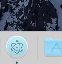

# Downloading a file using DownloadItem

In this tutorial we will be looking at downloading a file using the `Session`'s `will-download` event listener.

There are some differences between the Mac and Windows platforms that may present some problems in how each work.  For instance the `<a>` anchor element link, [which points to a `.mp4` file](https://www.quirksmode.org/html5/videos/big_buck_bunny.mp4), we use in this tutorial is treated differently between platforms.  On Windows it will trigger the `will-download` event but on Mac it will embed the video in and play it.  What we really want to do is download the link to our `downloads` directory no matter what platform we are using.

Another difference that may be seen was how the save dialog of the default event was handled.  On Mac as long as the first command was a `DownloadItem.SavePath` then the save dialog was not presented but on Windows that did not seem to work consistently.

The code below should work with `<a>` anchor elements as well any other download you want to throw at it.

[Create a new `WebSharp Electron Application`](https://github.com/xamarin/WebSharp/blob/master/docs/getting-started/getting-started-websharp-electron-application.md#generate-a-websharp-electron-application) and open it in you favorite source editor.  

## index.html

Add a `<a>` link element to the `index.html`'s `<body>` element that will serve as our file to download.

```js

  <body>

    ...

    <p></p>
    <a id="link"  href="https://www.quirksmode.org/html5/videos/big_buck_bunny.mp4">Click to download</a>
  </body>

```

Of course the above can be anything you want.  

## Renderer process

The source code accompying this tutorial that takes care of the renderer process is named `SessionDownload.cs` so open it up.  Yours may be different if you started from scratch.

What we are going to do add an event listener to the `click` event of the our anchor element with the id `link`.

```cs

        // Get a reference to the DOM Document
        var document = await HtmlPage.GetDocument();

        // Get a reference to the "link" element
        var link = await document.GetElementById("link");
        // Attach an event listener to the "click" event
        await link.AttachEvent("click", onMouseClick);

```

For more information on accessing the DOM and events please take a look at the [DOM Overview](../DOM/overview.md).

Next create our mouse click handler method.

```cs

    private async void onMouseClick(object sender, HtmlEventArgs args)
    {
        // Prevent the default click handler `will-download` from firing.
        args.PreventDefault();
        //args.StopPropagation();

        // Using the sender object we will obtain the `href`
        // information from the `<a>` anchor element.
        var target = sender as HtmlElement;
        var href = await target.GetProperty<string>("href");
        await console.Log($"clicked {await target?.GetId()} for {href}");
        
        // Notifiy the Main process that it should handle the download
        var ipcRenderer = await IpcRenderer.Create();
        ipcRenderer.Send("download-file", href);

    }

```

The first thing the `click` handler does is call `PreventDefault()` which stops the `will-download` method from firing.  Remember we want to be consistant across platforms when dealing with the default handling of the different mime types.

The approach here will send a inter process message to the `Main` process to handle the download using the `IpcRenderer` class.  To do that obtain the `href` element information and and using the `Send` method with a channel name `download-file`.

That should do it for the `Renderer` process so we will now move on to the `Main` process.

## Main process

Most of the time any long running processes will want to be moved to the `Main` process and let the `Renderer` process do what it does best which is rendering.

Open the `MainWindow.cs` file and look for the `CreateWindow` method call.

```cs

    // We use app.IsReady instead of listening for the 'ready'event.
    // By the time we get here from the main.js module the 'ready' event has
    // already fired.
    if (await app.IsReady())
    {
        windowId = await CreateWindow(__dirname);

        // add channel listener code here ...
    }    

```

Add a channel listener for `download-file` messages.

```cs

    // attach a listener to download the file.
    var ipcMain = await IpcMain.Create();
    ipcMain.On("download-file",
        new IpcMainEventListener
        (
            async(result) =>
            {
                var state = result.CallbackState as object[];
                var ipcMainEvent = (IpcMainEvent)state[0];
                var parms = state[1] as object[];

                // foreach (var parm in parms)
                //     System.Console.WriteLine($"\tparm: {parm}");

                // Call the DownloadFile helper method
                await DownloadFile(parms[0].ToString());
            }
        )
    );

```

The method above retrieves the file url passed from the `Renderer` process and passes it to the `DownloadFile` helper method that we have yet to define.

The `DownloadFile` helper method is the workhorse of our routine.  Once we get a `will-download` event we will hand that off to `HandleDownload`.

```cs

       // Attaches a will-download listener to the session and initiates the download
        async Task DownloadFile(string fileURL)
        {
            var webContents = await mainWindow.GetWebContents();
            var session = await webContents.GetSession();
            await session.SetDownloadPath("downloads");
            
            await webContents.DownloadURL(fileURL);

            await session.Once("will-download",
                new ScriptObjectCallback<Event, DownloadItem, WebContents>(
                    async (callbackResult) => 
                    {
                        await HandleDownload(new WillDownloadResult(callbackResult), fileURL);
                    }
                )
            );

        }

```


The `HandleDownload` method takes care of calculating the progress and setting up the UI feedback by using the `SetProgressBar` method of Electron's `BrowserWindow`.

```cs

    // Handles the file download from a will-download listener attached to a session.
    async Task HandleDownload(WillDownloadResult cr, string fileURL)
    {
        var filename = System.IO.Path.GetFileName(fileURL);

        // Set our save path.  If it does not exist it will silently be created.
        await cr.DownloadItem.SetSavePath($"downloads/{filename}");

        // Get the total size of the file to be downloaded so we can calculate
        // the percentage progress.
        var size = await cr.DownloadItem.GetTotalBytes();
        
        // Listen for the updated event
        await cr.DownloadItem.On("updated",
            new ScriptObjectCallback<Event, string>(
                async (updatedResult) => 
                {
                    var update = updatedResult.CallbackState as object[];
                    var updateState = update[1].ToString();

                    // calculate the percentage
                    var percentage = (await cr.DownloadItem.GetReceivedBytes()) / (float)size;

                    // Set the progress bar.
                    await mainWindow.SetProgressBar(percentage, new ProgressBarOptions() {Mode = ProgressBarMode.Normal});

                    if (updateState == "interrupted")
                        await mainWindow.SetProgressBar(percentage, new ProgressBarOptions() {Mode = ProgressBarMode.Error});
                    else if (updateState == "progressing")
                    {
                        if (await cr.DownloadItem.IsPaused())
                            await mainWindow.SetProgressBar(percentage, new ProgressBarOptions() {Mode = ProgressBarMode.Paused});
                        else
                            await mainWindow.SetProgressBar(percentage, new ProgressBarOptions() {Mode = ProgressBarMode.Normal});                                                                
                    }
                }
            )
        );
        
        // Listen for when the file is finished downloaded.
        await cr.DownloadItem.Once("done",
            new ScriptObjectCallback<Event, string>(
                async (doneResult) => 
                {
                    var done = doneResult.CallbackState as object[];
                    var doneState = done[1].ToString(); 

                    // check if the download completed and set the progress bar option 
                    // accordingly.
                    if (doneState == "completed")
                    {
                        if (IsWindows)
                        {
                            // Flash the frame on windows.
                            await mainWindow.SetProgressBar(1.0f, new ProgressBarOptions() {Mode = ProgressBarMode.None});
                            await mainWindow.FlashFrame(true);
                        }
                        else
                        {
                            // Bounce the doc on Mac.
                            await mainWindow.SetProgressBar(-1.0f);
                            var dock = await app.Dock();
                            await dock.Bounce(DockBounceType.Informational);
                            await dock.DownloadFinished(fileURL);
                        }
                    }
                    else 
                        await mainWindow.SetProgressBar(1.0f, new ProgressBarOptions() {Mode = ProgressBarMode.Error});
                }
            )
        );

    }

```

:bulb: The `SetProgressBar` works differently on Windows than on Mac where we can set a `ProgressBarMode` that is only valid on Windows.  See the [SetProgressBar](https://electron.atom.io/docs/api/browser-window/#winsetprogressbarprogress-options) api documentation.

Valid enumeration values for `ProgressBarMode` are as follows:

| Value | Description |
| --- | --- |
| None | No progress indicator is displayed in the taskbar button.  |
| Normal | A green progress indicator is displayed in the taskbar button. Default value. |
| Indeterminate | A pulsing green indicator is displayed in the taskbar button. |  
| Error | A red progress indicator is displayed in the taskbar button. |
| Paused | A yellow progress indicator is displayed in the taskbar button. |


- Mac



- Windows


## Summary

In this tutorial we saw how to initiate a manual download and provide user feedback of the download progress via the `SetProgressBar` method of the `BrowserWindow`.

The `SetProgressBar` method works differently on Windows and Mac by setting a `ProgressBarMode` that tells Windows to draw the progress bar manually.  On Mac this setting will be ignored.

There is also two different ways to grab the users attention presented in the above code.  On Windows we used the [FlashFrame](https://electron.atom.io/docs/api/browser-window/#winflashframeflag) method where on Mac we used the [Bounce](https://electron.atom.io/docs/api/app/#appdockbouncetype-macos).


