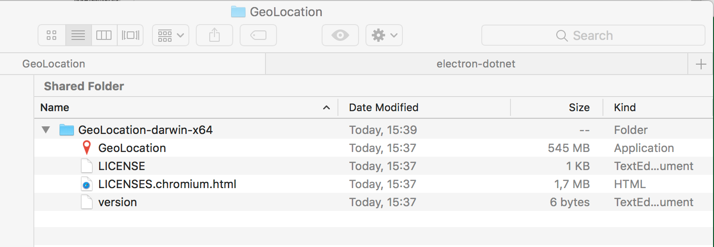

# Creating Executables for your app

We are now to point where we have finished our application and need to start thinking about delivering to the user.  To do this we need to create an executable for each of the Operating Systems that we want to support.  Fortunately for us `Electron` offers a few tools to make this easier.

In this tutorial, we will use [electron-packager](https://www.npmjs.com/package/electron-packager) to create an executable file for the platform of your choice.

## Prerequisites: symlinked electron-dotnet

If you have been using the symlinked option of `electron-dotnet` as described in the Getting Started sections, [See Getting Started on Windows](https://github.com/xamarin/WebSharp/blob/master/docs/getting-started/getting-started-dev-windows.md) or [See Getting Started on Mac](https://github.com/xamarin/WebSharp/blob/master/docs/getting-started/getting-started-dev-mac.md), you will need to actually switch to using the installed version so that `electron-packager` can pick up the correct file.

To unlink `electron-dotnet`, use the `npm unlink` command.

```bash
npm unlink electron-dotnet
```

Install `WebSharp`'s `electron-dotnet` module.

```bash
npm install --save path-to-websharp/electron-dotnet
```

> :bulb: Make sure you use the `--save` command so that when we package the application it will be included as a dependency.

After this, we can continue.

## Installing `electron-packager`

[electron-packager](https://www.npmjs.com/package/electron-packager) can be installed just as any other npm package.

Straight from the [Install](https://www.npmjs.com/package/electron-packager#installation).

```bash
# for use in npm scripts 
npm install electron-packager --save-dev
 
# for use from cli 
npm install electron-packager -g
```

> :bulb: Make sure you use the `--save-dev` command so that when we package the application it will not be included as a dependency.

## Creating package

From the `electron-packager` [Usage](https://www.npmjs.com/package/electron-packager#usage) section we see the following:

```bash
electron-packager <sourcedir> <appname> --platform=<platform> --arch=<arch> [optional flags...]
```

> Looking through the rest of Usage documentation will show all the documentation for the `[optional flags]`.

From the main directory of the application we can execute the following:

```bash
geolocation$ electron-packager ./ GeoLocation --platform=darwin --arch=x64 --out=./GeoLocation --overwrite --prune=true --icon=./images/icons/appicon.icns 
```

You will notice in the above command we added some extra options.

| Flag | Description |
| --- | --- |
| [--out](https://github.com/electron-userland/electron-packager/blob/master/docs/api.md#out) | The base directory where the finished package(s) are created. |
| [--overwrite](https://github.com/electron-userland/electron-packager/blob/master/docs/api.md#overwrite) | Whether to replace an already existing output directory for a given platform (true) or skip recreating it (false). |
| [--prune](https://github.com/electron-userland/electron-packager/blob/master/docs/api.md#prune) | Runs the package manager command to remove all of the packages specified in the devDependencies section of package.json from the outputted Electron app. |
| [--icon](https://github.com/electron-userland/electron-packager/blob/master/docs/api.md#icon) | The local path to the icon file if the target platform supports setting embedding an icon. |

> The `--prune` docs say the default is (yes) but on `Windows` it did not seem to work unless it was specified.

Notice above that we specified the `--icon` flag as well.  This is so that the application uses the icon when starting up or the application will default to `Electron`'s icon set.

One that is run we should have a `GeoLocation/GeoLocation-darwin-x64` directory created.

Sample output as follows:

```bash

Packaging app for platform darwin x64 using electron v1.7.5
Wrote new app to GeoLocation/GeoLocation-darwin-x64

```



Double clicking on the `GeoLocation` file will execute the application.

## Other operating systems

The good thing about the tool is that it works the same on `Windows`.  Give it a try.


## Summary

That was not painful at all.  `Electron` offers a lot of different tools and utilities so it would not be practical to go through all of them.  Take a look around on the `npm` site to see if any of them fit what you are looking for.

If you want to create a `dmg` file to deliver your Mac application take a look at [electron-installer-dmg](https://www.npmjs.com/package/electron-installer-dmg) which will take the application that we just packaged and create a `dmg` installer for it.

For windows take a look at [electron-windows-store](https://www.npmjs.com/package/electron-windows-store).

These both work with the packaged output of `electron-packager`.

Another utility that you may want to look at is [electron-builder](https://www.npmjs.com/package/electron-builder) that says it is:

> A complete solution to package and build a ready for distribution Electron app for macOS, Windows and Linux with “auto update” support out of the box.

Have a play around with it.

For more information see the following:

1. Getting started documents

    * [See Getting Started on Windows](https://github.com/xamarin/WebSharp/blob/master/docs/getting-started/getting-started-dev-windows.md)
   
    * [See Getting Started on Mac](https://github.com/xamarin/WebSharp/blob/master/docs/getting-started/getting-started-dev-mac.md)

1. [Create a new `WebSharp Electron Application`](https://github.com/xamarin/WebSharp/blob/master/docs/getting-started/getting-started-websharp-electron-application.md#generate-a-websharp-electron-application)

1. [DOM Overview](https://github.com/xamarin/WebSharp/blob/master/docs/tutorials/DOM/overview.md)

1. [Google API Keys](https://developers.google.com/console)

1. [Electron Environment Variables](https://github.com/electron/electron/blob/master/docs/api/environment-variables.md#environment-variables)

1. [Getting Started Building Websharp Electron Application Assemblies](https://github.com/xamarin/WebSharp/blob/master/docs/getting-started/getting-started-websharp-building-assemblies.md)

1. [Distinguishing "development" from "production"](https://github.com/electron/electron/issues/7714).

1. [electron-is-dev](https://www.npmjs.com/package/electron-is-dev)

1. [electron-packager](https://www.npmjs.com/package/electron-packager)

1. [electron-installer-dmg](https://www.npmjs.com/package/electron-installer-dmg)

1. [electron-windows-store](https://www.npmjs.com/package/electron-windows-store)