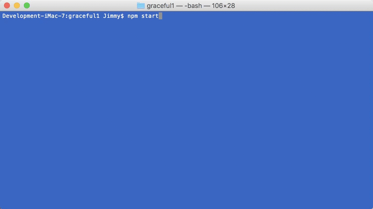

# Showing Windows Gracefully - Setting BackgroundColor

This tutorial will focus on the startup flicker of an Electron App and one approach to fixing it by setting the background color.

What causes the flicker is the initial loading period from when the app launches to when the initial content is loaded in.  Fast when using a local html file from the file system but there is still the initial flicker that takes away from how a native app might work.

Create a new `WebSharp Electron Application` and open it in you favorite source editor.

Let's add a style element to the index.html file to show this flicker that we will be talking about.

Open the `index.html` source file and  

``` html

   <style media="screen">
      body {
        height: 100%;
        background-color: blueviolet
      }
      </style>
```

Now run the app.  

``` bash
# MacOSX Terminal or Windows command line
> npm start

```

As you can see we get the white background first and then the background color changes as the `index.html` is loaded in.  This is the flicker that we are referring to.


One of the possible solutions for this is mentioned in the Electron documentation [Showing window gracefully](https://github.com/electron/electron/blob/master/docs/api/browser-window.md#showing-window-gracefully).

Here we will be looking at the [setting backgroundcolor](https://github.com/electron/electron/blob/master/docs/api/browser-window.md#setting-backgroundcolor) alternative instead of the using the `ready-to-show` event solution.

Go to the `src/Main/MainWindow.cs` source file and look for the `CreateWindow` method.

        async Task<int> CreateWindow (string __dirname)
        {
            // Create the browser window.
            mainWindow = await BrowserWindow.Create(new BrowserWindowOptions() { Width = 600, Height = 400 });

            // and load the index.html of the app.
            await mainWindow.LoadURL($"file://{__dirname}/index.html");

            // Open the DevTools
            //await mainWindow.GetWebContents().ContinueWith(
            //        (t) => { t.Result?.OpenDevTools(DevToolsMode.Bottom); }
            //);

            return await mainWindow.GetId();

        }

Change the `BrowserWindowOptions() {}`

``` c-sharp

            // Create the browser window.
            mainWindow = await BrowserWindow.Create(new BrowserWindowOptions() { Width = 600, Height = 400 });

```

What we will want to do is set the `BackgroundColor` property of the `BrowserWindowOption` instance that we will pass to the `Create` method of `BrowserWindow`. 

``` c-sharp

            // Create the browser window.
            mainWindow = await BrowserWindow.Create(new BrowserWindowOptions() { Width = 600, Height = 400, BackgroundColor = "#8A2BE2" });

```

The `BackgroundColor` property takes a hex string that represents the html [Color Values](https://www.w3schools.com/colors/colors_hex.asp)

Now let's run the application again.

``` bash
# MacOSX Terminal or Windows command line
> npm start

```



## Summary

In this tutorial we have attempted to fix the `white screen` flicker when starting the app.  If you application uses a combination of colors then this setting the background color may not be enough.  The docs make a not of saying:

> Note that even for apps that use `ready-to-show` event, it is still recommended
to set `backgroundColor` to make app feel more native.

