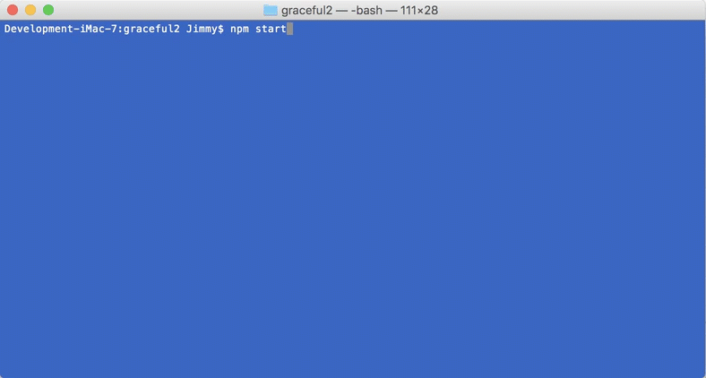
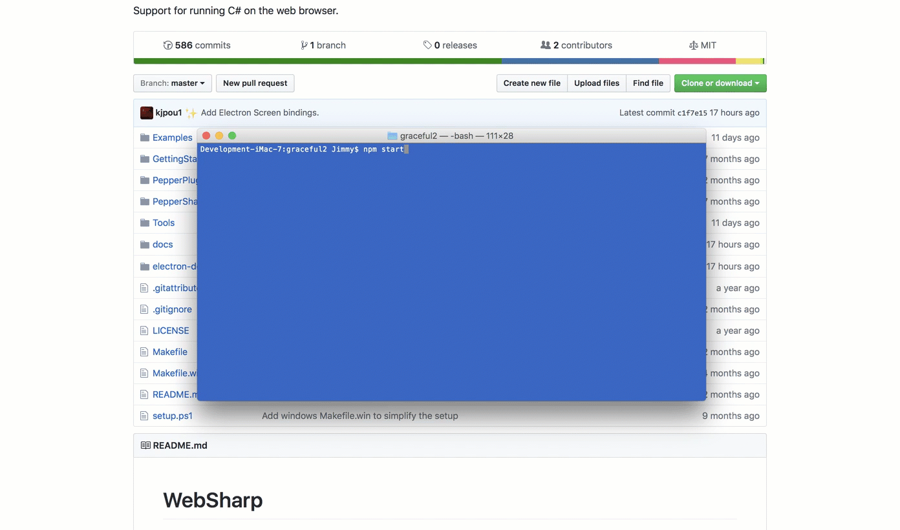

# Showing Windows Gracefully - Using `ready-to-show` Event

This tutorial will focus on the startup flicker of an Electron App and one approach to fixing it by using `ready-to-show` Event.

What causes the flicker is the initial loading period from when the app launches to when the initial content is loaded in.  Fast when using a local html file from the file system but there is still the initial flicker that takes away from how a native app might work.

[Create a new `WebSharp Electron Application`](https://github.com/xamarin/WebSharp/blob/master/docs/getting-started/getting-started-websharp-electron-application.md#generate-a-websharp-electron-application) and open it in you favorite source editor.

We will not be using the `index.html` file in this tutorial but instead will load content from an external source [playcode.io](https://playcode.io) so that we can produce a large enough delay as described above.

```cs

            // and load the external site playcode.io of the app.
            await mainWindow.LoadURL($"https://playcode.io");

```

Let's run the application to demonstrate the `white-screen` flicker.

``` bash
# MacOSX Terminal or Windows command line
> npm start

```

As you can see we get the white background first and then the background color changes as the external content is loaded in.  This is the flicker that we are referring to.



One of the solutions was previously covered in the [Showing Windows Gracefully - Setting BackgroundColor](../graceful1) tutorial.  This approach involves setting the  `BackgroundColor` close to your app's background.  In this case it looks mostly `Black` so that is the color that we will be using which seems close.

Let's see what that does.  Following the previous tutorial we will set the `BackgroundColor` to `Black (#000000)`

```cs

            // Create the browser window.
            mainWindow = await BrowserWindow.Create(
                new BrowserWindowOptions() { 
                    Width = 600,
                    Height = 400,
                    BackgroundColor = "#000000", // black
                }
            );

```

``` bash
# MacOSX Terminal or Windows command line
> npm start

```


That is better with no `white screen` flicker when the content is loaded.

Now what if the application requires heavy network load that causes an even longer delay due to a slow network connection.  We would have the black screen sitting there waiting.

One of the possible solutions for this is mentioned in the Electron documentation [Showing window gracefully](https://github.com/electron/electron/blob/master/docs/api/browser-window.md#showing-window-gracefully).

The solution we will be looking at is [Using ready-to-show event](https://github.com/electron/electron/blob/master/docs/api/browser-window.md#using-ready-to-show-event) solution.

Go to the `src/Main/MainWindow.cs` source file and look for the `CreateWindow` method.

```cs

        async Task<int> CreateWindow (string __dirname)
        {
            // Create the browser window.
            mainWindow = await BrowserWindow.Create(
                new BrowserWindowOptions() { 
                    Width = 1280, 
                    Height = 720,
                    BackgroundColor = "#000000", // black 
                    Show = false 
                }
            );

            await mainWindow.Once("ready-to-show", 
                new ScriptObjectCallback(async (evt) =>
                    {
                        await mainWindow.Show();
                    }

                )
            );

            // and load the external site playcode.io of the app.
            await mainWindow.LoadURL($"https://playcode.io");

            // Open the DevTools
            //await mainWindow.GetWebContents().ContinueWith(
            //        (t) => { t.Result?.OpenDevTools(DevToolsMode.Bottom); }
            //);

            return await mainWindow.GetId();

        }

```

The `BrowserWindow` takes an instance of `BrowserWindowOptions` when creating the instance.  

```cs

            // Create the browser window.
            mainWindow = await BrowserWindow.Create(
                new BrowserWindowOptions() { 
                    Width = 1280, 
                    Height = 720,
                    BackgroundColor = "#000000", // black 
                    Show = false 
                }
            );

```

What we will want to do is set the `Show` property of the `BrowserWindowOption` instance to `false`.  This will prevent the window from displaying.

> Notice that we also change the default `Width` and `Height` to something a little better to display the content as well as leaving the `BackgroundColor` set to `Black (#000000)`.  

Now if you run the project you will see that no window will be displayed at all which is not practical although it did get rid of the flicker.

From the documentation it says:

> While loading the page, the `ready-to-show` event will be emitted when the renderer process has rendered the page for the first time if the window has not been shown yet. Showing the window after this event will have no visual flash:

So, we will then add that code.  Since the `ready-to-show` event is emitted only once we will use the `Once` method which will fire once and then remove itself from the events that are being tracked.

> :bulb: `emitter.Once` adds a one time listener function for the event named `eventName`. The next time `eventName` is triggered, this listener is removed and then invoked.

```cs

            await mainWindow.Once("ready-to-show", 
                new ScriptObjectCallback(async (evt) =>
                    {
                        await mainWindow.Show();
                    }

                )
            );

```

When we receive this event we will then show the window with the `BrowserWindow`'s `Show` method.

> This event is usually emitted after the `did-finish-load` event, but for pages with many remote resources, it may be emitted before the `did-finish-load` event.

Now let's run the application again.

``` bash
# MacOSX Terminal or Windows command line
> npm start

```



## Summary

In this tutorial we have attempted to fix the `white screen` flicker when starting the app by using a combination of solutions, waiting for the `ready-to-show` event as well as setting the background color of the `BrowserWindow`.  By setting only the background color the flicker would have been minimized but with a heavier network load or slower connection that delay could have the user wondering what was going on. 

:bulb: By default when creating a `WebSharp Electron Application`, on-the-fly compiling is used and does have it's own delay that is added to the startup.  To compile the modules take a look at [Getting Started Building Websharp Electron Application Assemblies](https://github.com/xamarin/WebSharp/blob/master/docs/getting-started/getting-started-websharp-building-assemblies.md).