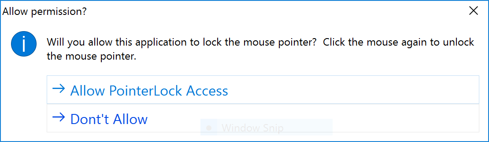

# Granting access to PointerLock

Example of granting permission to `pointer-lock` in an `Electron` application using the `Sessions`'s `SetPermissionRequestHandler`.

In a chromium web application some resources may ask for some type of local permission, examples can be `media`, `geolocation`, `notifications`, `midiSysex`, `pointerLock`, `fullscreen`, `openExternal`.  This is all built into chromium as well as the confirmation window message of some sort granting permission to that resource.  With `Electron` because it is a desktop app, it is automatically trusted with access, so there’s no permission being presented to the user.  This will need to be handled by the developer.  For the developer to do that they will need to be notified, via a callback method, when any of these resources request permission. 

> From the [Pointer Lock API](https://developer.mozilla.org/en-US/docs/Web/API/Pointer_Lock_API) documentation.  The Pointer Lock API provides input methods based on the movement of the mouse over time (i.e., deltas), not just the absolute position of the mouse cursor in the viewport. It gives you access to raw mouse movement, locks the target of mouse events to a single element, eliminates limits on how far mouse movement can go in a single direction, and removes the cursor from view.

[Create a new `WebSharp Electron Application`](https://github.com/xamarin/WebSharp/blob/master/docs/getting-started/getting-started-websharp-electron-application.md#generate-a-websharp-electron-application) and open it in you favorite source editor.  

## Main process

Let's start with the Main process and setting up our permission handler.

Open the `src/Main/MainWindow.cs` file in your project and look for the `CreateWindow` method call.

```cs

        // We use app.IsReady instead of listening for the 'ready'event.
        // By the time we get here from the main.js module the 'ready' event has
        // already fired.
        if (await app.IsReady())
        {
            windowId = await CreateWindow(__dirname);

            // Add the permission request handler here.
            
        }

```

The permission request handler is set on a `Session` object.  So we need to obtain a `Session` object which can be a named partition or the `Session` of our main window.

```cs

        // Get our session
        try
        {
            session = await Session.FromPartition("partition:nameofpartition");
        }
        catch (Exception sexc)
        {
            await console.Log($"logging: {sexc.Message}");
            var web = await mainWindow.GetWebContents();
            session = await web.GetSession();
        }
        if (session != null)
        {

            // Add Permission Request handler code here.
        }
    }

```

In the above code we first ask for a specific named partition `partition:nameofpartition` if setting up custom partitions and if that partition was not found we will get the session from our main `BrowserWindow`s `WebContents`.

Once we have a session we can then add the code that will setup the permission request callback handler.

```cs

                        await session.SetPermissionRequestHandler(
                            new ScriptObjectCallback<WebContents, string, Func<object, Task<object>>>(

                                async (callbackResult) =>
                                {
                                    var permissionResult = new PermissionRequestResult(callbackResult);

                                    var url = await permissionResult.WebContents.GetURL();
                                    await console.Log($"Received permission request from {url} for access to \"{permissionResult.Permission}\".");
                                    if (permissionResult.Permission == Permission.PointerLock)
                                         permissionResult.Callback(await GrantAccess(permissionResult.Permission));
                                    else
                                        permissionResult.Callback(true);
                                    
                                }
                            )
                        );


```

The [SetPermissionHandler](https://electron.atom.io/docs/api/session/#sessetpermissionrequesthandlerhandler) takes a `ScriptObjectCallback` instance `ScriptObjectCallback<WebContents, string, Func<object, Task<object>>>` that when triggered will have access to the `WebContents` that it was emitted from, the permission being requested access for as a string and a callback function that is called with `true` to grant permission or `false` to deny it.

When the callback is triggered all the information above can be accessed via a `PermissionRequestResult`.  It provides access to the following:

| Property | Description |
| --- | --- |
| WebContents | The WebContents requesting the permission. |
| Permission | A C# enum of the specific permission being requested. |
| PermissionValue | A string value of the specific permission being requested |
| Callback | A Function that is called with a `Boolean` to allow or deny the permission |

To obtain the specific permission being requested we use the `Permission` property of the `PermissionRequestResult` for `Permission.PointerLock`.

```cs

    if (permissionResult.Permission == Permission.PointerLock)
                                            permissionResult.Callback(await GrantAccess(permissionResult.Permission));
                                        else
                                            permissionResult.Callback(true);

```

If the permission request is for anything other than `Permission.PointerLock` we go ahead and allow it.

For a `Permission.PointerLock` permission request we will call the method `GrantPermission` that prevents a dialog to grant access or not.

```cs

    async Task<bool> GrantAccess(Permission permission)
    {
        var dialog = await Dialog.Instance();
        var options = new MessageBoxOptions() 
        {
            MessageBoxType = MessageBoxType.Question,
            Buttons = new string[] {"Allow PointerLock Access", "Dont't Allow"},
            Title = $"Allow permission?",
            Detail = $"Will you allow this application to lock the mouse pointer?"
            + "  Click the mouse again to unlock the mouse pointer.",
        };
        var result = await dialog.ShowMessageBox(mainWindow, options);
        await console.Log(result);
        if (result == 0)
            return true;
        else
            return false;
    }


```

The above code uses the `ShowMessageBox` method available from a `Dialog` instance to present a message box to the user.

Notice that we pass `MessageBoxType = MessageBoxType.Question` as the type property of the [MessageBoxOptions](https://electron.atom.io/docs/api/dialog/#dialogshowmessageboxbrowserwindow-options-callback) class.  

> :bulb: On Windows, `MessageBoxType.Question` displays the same icon as "info", unless you set an icon using the "icon" option. On macOS, both `MessageBoxType.Warning` and `MessageBoxType.Error` display the same warning icon.




# Renderer

Since this is more a tutorial on permissions, for the `Renderer` code we will refer to the code description and sample walk through of the Html 5 [Pointer Lock API](https://developer.mozilla.org/en-US/docs/Web/API/Pointer_Lock_API) docs from which the code was taken.

You can view the full C# source code of [Pointer](./src/Pointer/Pointer.cs) class which uses the Html 5 `Canvas` element and [requestAnimationFrame](https://developer.mozilla.org/en-US/docs/Web/API/window/requestAnimationFrame) for the red ball animation.


## Summary

This tutorial shows how to grant access to the [Pointer Lock API](https://developer.mozilla.org/en-US/docs/Web/API/Pointer_Lock_API) by attaching a `PermissionRequestHandler` to the `Session` object.  

Also demonstrated is accessing Html specific API's such as drawing on a `Canvas` and Animation via the `requestAnimationFrame` using C#.

Other possible permissions can be found in the Permission enum, as follows:

```cs

    public enum Permission
    {
        Undefined,
        Media,
        GeoLocation,
        Notifications,
        MidiSysex,
        PointerLock,
        FullScreen,
        OpenExternal
    }

```

