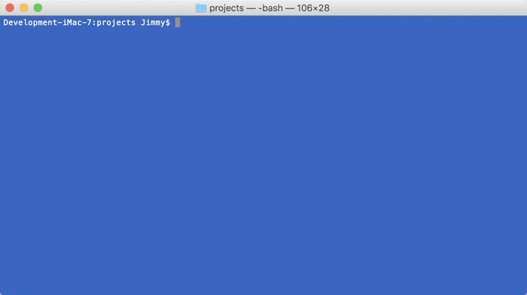
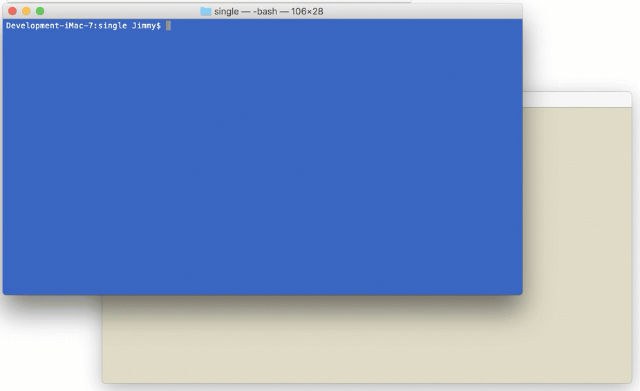

# Create a WebSharp Electron SingleInstance application

This tutorial will focus on making your application a Single Instance Application.  What this refers to is ensuring that only a single instance of your app is running at any given time.  Such a requirement usually depends on the scenario you are currently working on.  If this is one of your requirements then continue on to find out how to use the `MakeSingleInstance` method of the `App` instance.

One course of action to take is restore the old instance's main window if it is minimized or hidden and then place the focus on that window.

First let's get some code to work with by [Creating a new `WebSharp Electron Application`](https://github.com/xamarin/WebSharp/blob/master/docs/getting-started/getting-started-websharp-electron-application.md#generate-a-websharp-electron-application) and open it in you favorite source editor.



Go to the `src/Main/MainWindow.cs` source file and let's create a new method call `MakeSingeInstance`.

```cs

        // Make this app a single instance app.
        //
        // The main window will be restored and focused instead of a second window
        // opened when a person attempts to launch a second instance.
        //
        // Returns true if the current version of the app should quit instead of
        // launching.
        async Task<bool> MakeSingleInstance()
        {
            return await app.MakeSingleInstance(new ScriptObjectCallback<string[], string>(
                    async (cr) =>
                    {
                        var state = cr.CallbackState as object[];
                        if (state != null)
                        {
                            // let's get the arguments that we were called with
                            var args = state[0] as object[];

                            await console.Log($"we have {args?.Length} args ");
                            foreach (string arg in args)
                                await console.Log($"   arg: {arg}");
                            if (state[1] != null)
                                await console.Log($"working directory: {state[1]}");
                        }

                        if (mainWindow != null)
                        {
                            if (await mainWindow.IsMinimized())
                                await mainWindow.Restore();
                            await mainWindow.Focus();
                        }
                        
                    }


                ));
        }       

```


This method returns `false` if your process is the primary instance of the application and your app should continue loading. And returns `true` if your process has sent its parameters to another instance, and you should immediately quit.

From the `Electron` [documentation for `app.makeSingleInstance`](https://electron.atom.io/docs/api/app/#appmakesingleinstancecallback) the `MakeSingleInstance` method of the `App` instance takes a callback that will be called when a second instance is executed.

Below we see the strongly typed callback that is passed to the `MakeSingeInstance` method.

```cs
   new ScriptObjectCallback<string[], string>(...)
```

The types that will be pass back and make available in `CallbackState` of the result when it is executed is:

- string[] - Array of the second instance’s command line arguments.
- string - The current working directory of the second instance.

In the callback we will write out the state information of the call.  This is not necasssary but we will use this to demonstrate flow of events.

```cs
        var state = cr.CallbackState as object[];
        if (state != null)
        {
            // let's get the arguments that we were called with
            var args = state[0] as object[];

            await console.Log($"we have {args?.Length} args ");
            foreach (string arg in args)
                await console.Log($"   arg: {arg}");
            if (state[1] != null)
                await console.Log($"working directory: {state[1]}");
        }

```

The course of action that we will take when this scenario is triggered from another instances startup is to restore the main processe's windows and place focus on it.

```cs

            if (mainWindow != null)
            {
                if (await mainWindow.IsMinimized())
                    await mainWindow.Restore();
                await mainWindow.Focus();
            }

```

Now that we have our method in place we will add it to the main part of our code.

Right after we create obtain an instance to the App we need to make this check.

```cs

        app = await App.Instance();

        var isQuit = await MakeSingleInstance();
        if (isQuit)
            return await app.Quit();

```

We call the method `MakeSingleInstance` and set the boolean variable `isQuit` and then immediately check and quit the application if the method returns true.

That should do it for the code so let's take it for a drive.

You will need two different terminals or command windows open at the same time to see this working.

In the included animation we will use the blue terminal to start the first instance of the application and the light colored one to start a second instance.

Now let's run the application again.

``` bash
# MacOSX Terminal or Windows command line for the first instance
> npm start

```

After the first instance is started up switch to the second terminal or command line and run the command again.

``` bash
# MacOSX Terminal or Windows command line for the second instance
> npm start

```

You should see the application appear, it is then minimized and in the second terminal when the second instance is started the blue terminal prints out the information and the second instance just quits.



## Summary

We have touched on how to make your application a single instance by using the `App` instances `MakeSingleInstance` method.  Talked about the callback that is triggered when another instance is invoked.  Once the event is triggered we then handle it by restoring the main window of the first instance of the application and make sure it is focused on.

For more information about take a look at [Electron's App documentation](https://github.com/electron/electron/blob/master/docs/api/app.md)

### Tips

:bulb: On macOS the system enforces single instance automatically when users try to open a second instance of your app in Finder, and the `open-file` and `open-url` events will be emitted for that. However when users start your app in command line the system's single instance mechanism will be bypassed and you have to use this method to ensure single instance.

:bulb: If it is not working for you then take a look at the [Filed Issue #7764](https://github.com/electron/electron/issues/7764) where it was mentioned that there were some problems when the `name` and `productName` in `package.json` file were not the same.

