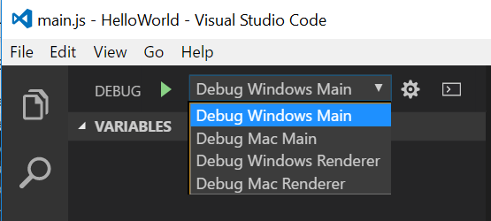
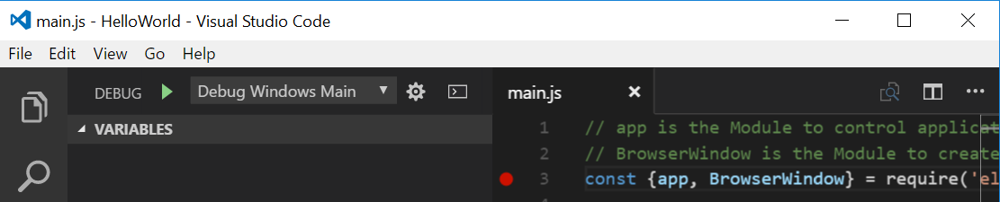
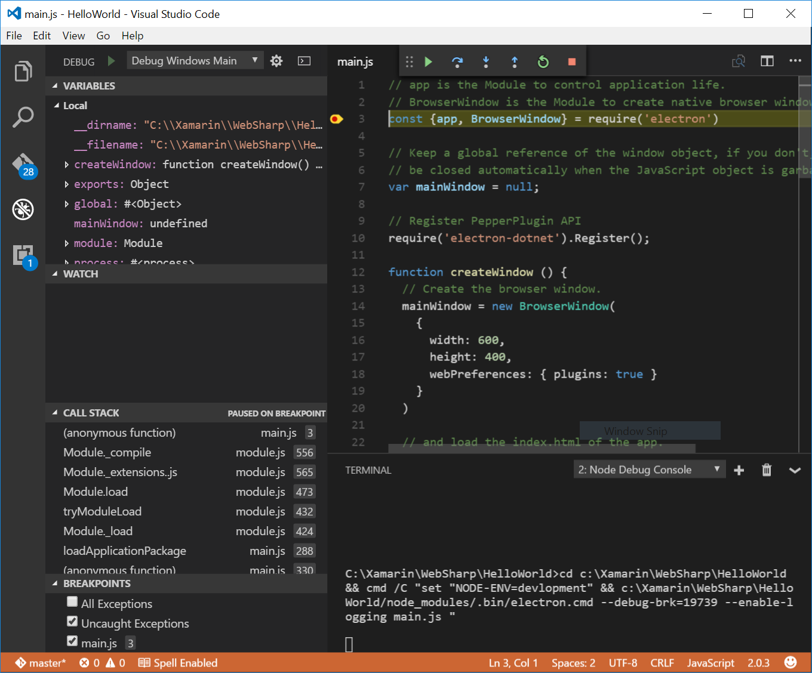

# Debugging with Visual Studio Code.

One file that was not touched on previously is the '.vscode/launch.json' file.  This section will go into more detail.

``` bash
.
|--- .vscode                           // VS Code integration
     |--- launch.json                  // Launch Configurations
     |--- settings.json

```

## Launch Configurations: launch.js 

``` json
// A launch configuration that launches the electron application inside a new window
{
  "version": "0.2.0",
  "configurations": [
    {
      "name": "Debug Windows Main",
      "type": "node",
      "request": "launch",
      "cwd": "${workspaceRoot}",
      "runtimeExecutable": "${workspaceRoot}/node_modules/.bin/electron.cmd",
      "program": "${workspaceRoot}/main.js",
      "runtimeArgs": [
        "--enable-logging"
      ],
      "stopOnEntry": false,
      "env": {
          "NODE-ENV": "devlopment"
      },
      "console": "integratedTerminal",  // internalConsole, integratedTerminal, externalTerminal
      "sourceMaps": false,
      "outDir": null
    },
    {
      "name": "Debug Mac Main",
      "type": "node",
      "request": "launch",
      "cwd": "${workspaceRoot}",
      "runtimeExecutable": "${workspaceRoot}/node_modules/.bin/electron",
      "program": "${workspaceRoot}/main.js",
      "runtimeArgs": [
        "--enable-logging"
      ],
      "stopOnEntry": false,
      "env": {
          "NODE-ENV": "devlopment"
      },
      "console": "integratedTerminal",  // internalConsole, integratedTerminal, externalTerminal
      "sourceMaps": false,
      "outDir": null
    },
    {
      "name": "Debug Windows Renderer",
      "type": "chrome",
      "request": "launch",
      "runtimeExecutable": "${workspaceRoot}/node_modules/.bin/electron.cmd",
      "runtimeArgs": [
        "${workspaceRoot}/main.js",
        "--enable-logging",
        "--remote-debugging-port=9222"
      ],
      "webRoot": "${workspaceRoot}",
      "stopOnEntry": false,
      "env": {
          "NODE-ENV": "devlopment"
      },
      "console": "integratedTerminal",  // internalConsole, integratedTerminal, externalTerminal
      "sourceMaps": false,
      "outDir": null
    },
    {
      "name": "Debug Mac Renderer",
      "type": "chrome",
      "request": "launch",
      "runtimeExecutable": "${workspaceRoot}/node_modules/.bin/electron",
      "runtimeArgs": [
        "${workspaceRoot}/main.js",
        "--enable-logging",
        "--remote-debugging-port=9222"
      ],
      "webRoot": "${workspaceRoot}",
      "stopOnEntry": false,
      "env": {
          "NODE-ENV": "devlopment"
      },
      "console": "integratedTerminal",  // internalConsole, integratedTerminal, externalTerminal
      "sourceMaps": false,
      "outDir": null
    }
  ]
}

```

As was touched on in the [Hello World!!! example](./example-hello-world.md) the `Electron` application runs in two processes, the `main process`, the process that runs `package.json`'s `main` script, and the `renderer process`, which each web page in Electron runs in.  Unfortunately there is a debugger for each one.

- Main - Node.js debugger - VS Code comes with a Node.js debugger installed. 
- Renderer - [Chrome's debugger](https://marketplace.visualstudio.com/items?itemName=msjsdiag.debugger-for-chrome).    

As you will notice there are 4 launch configurations:

- Debug Windows Main
  - Uses `Node.js` debugger.
- Debug Windows Renderer
  - Uses `Chrome`'s debugger.
- Debug Mac Main
  - Uses `Node.js` debugger.
- Debug Mac Renderer
  - Uses `Chrome`'s debugger.


## Debugging `Electron`'s Main Process

``` json
{
      "name": "Debug Windows Main",
      "type": "node",
      "request": "launch",
      "cwd": "${workspaceRoot}",
      "runtimeExecutable": "${workspaceRoot}/node_modules/.bin/electron.cmd",
      "program": "${workspaceRoot}/main.js",
      "runtimeArgs": [
        "--enable-logging"
      ],
      "stopOnEntry": false,
      "env": {
          "NODE-ENV": "devlopment"
      },
      "console": "integratedTerminal",  // internalConsole, integratedTerminal, externalTerminal
      "sourceMaps": false,
      "outDir": null
    },
    {
      "name": "Debug Mac Main",
      "type": "node",
      "request": "launch",
      "cwd": "${workspaceRoot}",
      "runtimeExecutable": "${workspaceRoot}/node_modules/.bin/electron",
      "program": "${workspaceRoot}/main.js",
      "runtimeArgs": [
        "--enable-logging"
      ],
      "stopOnEntry": false,
      "env": {
          "NODE-ENV": "devlopment"
      },
      "console": "integratedTerminal",  // internalConsole, integratedTerminal, externalTerminal
      "sourceMaps": false,
      "outDir": null
    },
```

There are two `"type": "node",` launch configurations above, one for Windows, `"name": "Debug Windows Main",` and the other for Mac OSX, `"name": "Debug Mac Main",`.  They differ by the way that the `Electron` application is launched.

Windows:

```    
      "runtimeExecutable": "${workspaceRoot}/node_modules/.bin/electron.cmd",
```

Mac OSX:

```
      "runtimeExecutable": "${workspaceRoot}/node_modules/.bin/electron",
```

Because `Electron` is launched differently on different operating systems we have delivered two different configurations already setup from the templates.

### Debugging `Electron`'s Main Process

To set a breakpoint in `main.js`, put the editor cursor on the first line and press F9 or simply click in the editor left gutter next to the line numbers. A red circle will appear in the gutter.


We now need to select the debugger configuration. Select the Debug View in the Side Bar:


Select the `Debug Windows Main` if your debugging from a windows machine or `Debug Mac Main` if your debugging from a Mac OSX machine from the Debug Configuration Drop Down.



> :bulb: On a Mac you would select `Debug Mac Main` from the drop down.

 

With the `Debug Windows Main`, or `Debug Mac Main` if you are on a Mac, Launch configuration selected, you can now click `Debug` tool bar green arrow or press F5 to launch and debug `main.js`. Your breakpoint will be hit and you can view and step through the code of `main.js`. Notice that VS Code displays an orange Status Bar to indicate it is in Debug mode and the DEBUG CONSOLE is displayed.



In the next section we will see how to install and use `Chrome`'s Debugger to debug the Renderer process.

### Debugging `Electron`'s Renderer Process

