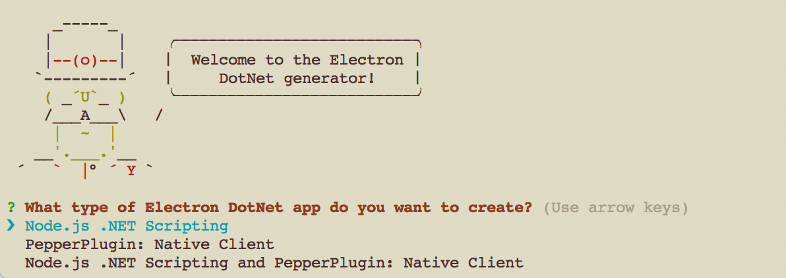
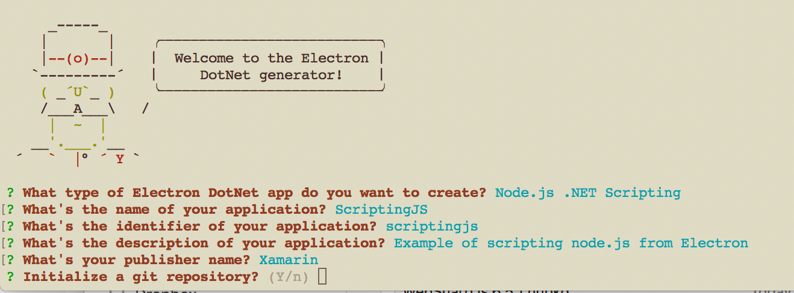
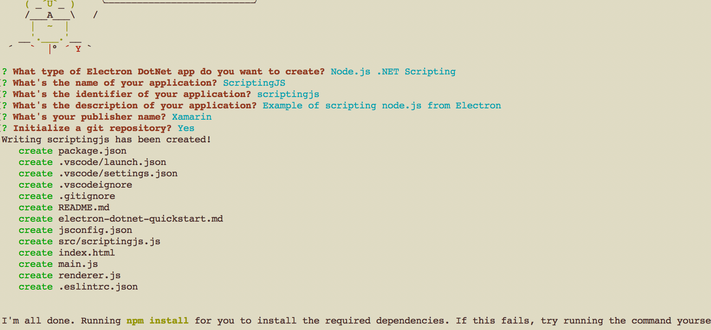
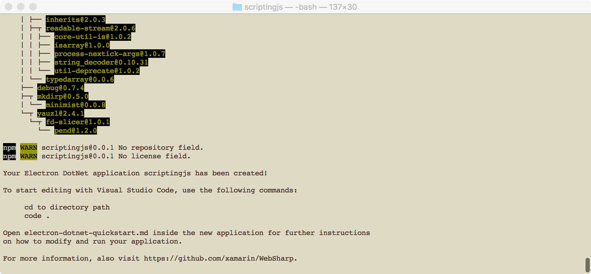
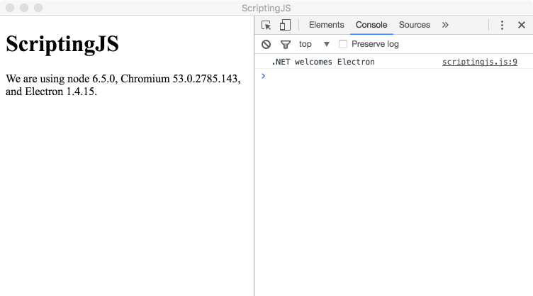

# Example Scripting Nodejs from Electron CLR Application

## ScriptingJS Application

This document will take you through creating an `Electron Dotnet` application for VS Code ("ScriptingJS") and will explain the basic `Nodejs` integration points from C# code to interact with `Nodejs` from your `Electron` application.

In this walkthrough, you'll begin with setting up a basic `Electron Dotnet` application that calls a C# routine from JavaScript code.  The C# function that is generated from the template formats a string and returns that formatted string back to the calling javascript function to be written out to the console from JavaScript code.

Once this is up and running we will begin modifying the application to script `NodeJs` functions directly from the C# application instead.  

## Prerequisites
You need [node.js](https://nodejs.org/en/) installed and available in your $PATH.
   * Plugins require [Mono](http://www.mono-project.com/download/) installed and available in your $PATH.
      
      > :bulb: Windows will need both the x86 and x64 bit versions installed and [available in your $PATH](https://github.com/xamarin/WebSharp/tree/master/electron-dotnet#setting-mono-path).
   * `electron-dotnet` needs to be built.  The easiest way is to use the provided `make` files available in the WebSharp base directory.  
   
      * [Windows Prerequisites](https://github.com/xamarin/WebSharp/tree/master/electron-dotnet#building-on-windows)
   
     ``` bash
     # Windows Visual Studio 2015 Command Line Prompt 
     nmake /f Makefile.win buildRelease
     ```

      * [Mac Prerequisites](https://github.com/xamarin/WebSharp/tree/master/electron-dotnet#building-on-osx)
     ``` bash
     # Mac OSX terminal with XCode tools available for build.
     make setup  # only needs to be run the first time
     make build
     ```
     
## Getting Started      
  * Install [.NET Core.](https://www.microsoft.com/net/core)
  * Install the [C# extension from the VS Code Marketplace](https://marketplace.visualstudio.com/items?itemName=ms-vscode.csharp).

## Generate a `Electron Dotnet` Application
The simplest way to add a new `Electron DotNet` application for VS Code consumption is through adding a project. A project will have all the boot strap files available to run the `Electron` application.  For more details you can look at the [Electron Quick Start](https://github.com/electron/electron-quick-start).

We have written a Yeoman generator to help get you started. Install Yeoman and the Yeoman Electron Dotnet generator that provides different templates for creating new applications:

``` bash
npm install -g yo path-to-WebSharp-directory\Tools\generator-electron-dotnet
yo electron-dotnet
```
You will be presented with three different project types. For this example, we will pick `Node.js .NET Scripting`.  

ß

Once the type of application project is selected the generator will present you with a series of questions so that the generator can generate the application for you.  Fill in the answers as shown in the following screen shot.



Hit enter to start generating the application structure.



This will install the dependencies automatically and when done you will have the application generated.




## The Structure of an application
After running, the generated application should have the following structure:

```
.
|--- .eslintrc.json
|--- .gitignore
|--- .vscode                           // VS Code integration
     |--- launch.json                  // Launch Configurations
     |--- settings.json
|--- .vscodeignore
|--- electron-dotnet-quickstart.md
|--- index.html                       // Html to be displayed in the app window
|--- jsconfig.json
|--- main.js                          // Defines the electron main process
|--- node_modules
     |--- All the node files used to run the electron application
|--- package.json                     // Various project metadata
|--- README.md
|--- renderer.js                      // Required in index.html and executed in the renderer process for that window 
|--- src                              // sources
     |--- scriptingjs.js              // javascript code implementation

```

Let's go through the purpose of some of these files and explain what they do:

### The application manifest: package.json
The format of `package.json` is exactly the same as that of [Node’s modules](https://docs.npmjs.com/getting-started/using-a-package.json), and the script specified by the `main` field is the startup script of your app, which will run the main process.

* It serves as documentation for what packages your project depends on.
* It allows you to specify the versions of a package that your project can use using [semantic versioning rules](https://docs.npmjs.com/getting-started/semantic-versioning).
* Makes your build reproducable which means that its way easier to share with other developers.

``` json
{
    "name": "scriptingjs",
    "displayName": "ScriptingJS",
    "description": "Example of scripting node.js from Electron",
    "version": "0.0.1",
    "publisher": "Xamarin",
    "main": "main.js",
    "scripts": {
        "start": "electron ."
    },
    "devDependencies": {
        "electron": "^1.4.0"
    }
}
```

As you can see above the information that was filled in from the template questions has been placed in this file.

Electron is listed as one of the devDependencies and should have been installed when the template was created.  

A `start` script has already been defined in the `scripts` section that can easily be run as the target of a `npm run` command and is the default target for `npm start`.  In this case since we are creating an Electron application is set to run `electron .`.

### Start up script of our app: main.js

The `main.js` should create windows and handle system events.

``` js
// app is the Module to control application life.
// BrowserWindow is the Module to create native browser window.
const {app, BrowserWindow} = require('electron')

// Keep a global reference of the window object, if you don't, the window will
// be closed automatically when the JavaScript object is garbage collected.
var mainWindow = null;

function createWindow () {
  // Create the browser window.
  mainWindow = new BrowserWindow({width: 600, height: 400})

  // and load the index.html of the app.
  mainWindow.loadURL(`file://${__dirname}/index.html`)

  // Open the DevTools.
  //mainWindow.webContents.openDevTools()

  // Emitted when the window is closed.
  mainWindow.on('closed', function () {
    // Dereference the window object, usually you would store windows
    // in an array if your app supports multi windows, this is the time
    // when you should delete the corresponding element.
    mainWindow = null
  })
}

// This method will be called when Electron has finished
// initialization and is ready to create browser windows.
// Some APIs can only be used after this event occurs.
app.on('ready', createWindow)

// Quit when all windows are closed.
app.on('window-all-closed', function () {
  // On OS X it is common for applications and their menu bar
  // to stay active until the user quits explicitly with Cmd + Q
  if (process.platform !== 'darwin') {
    app.quit()
  }
})

app.on('activate', function () {
  // On OS X it's common to re-create a window in the app when the
  // dock icon is clicked and there are no other windows open.
  if (mainWindow === null) {
    createWindow()
  }
})

// In this file you can include the rest of your app's specific main process
// code. You can also put them in separate files and require them here.

```

### Showing Information: index.html
The web page you want to show is defined in the static html file `index.html`.  This file is loaded from the `main.js` file referenced above in the `createWindow()` method.

``` js
 // and load the index.html of the app.
  mainWindow.loadURL(`file://${__dirname}/index.html`)
```

The static html file is just a normal file containing html elements that will be displayed in Electron's browser page.

``` html
<!DOCTYPE html>
<html>
  <head>
    <meta charset="UTF-8">
    <title>ScriptingJS</title>
  </head>
  <body>
    <h1>ScriptingJS</h1>
    <!-- All of the Node.js APIs are available in this renderer process. -->
    We are using node <script>document.write(process.versions.node)</script>,
    Chromium <script>document.write(process.versions.chrome)</script>,
    and Electron <script>document.write(process.versions.electron)</script>.
  </body>

  <script>
    // You can also require other files to run in this process
    require('./renderer.js')
  </script>
</html>

```

### Renderer Process: renderer.js

Since Electron uses Chromium for displaying web pages, Chromium’s multi-process architecture is also used. Each web page in Electron runs in its own process, which is called the renderer process.

In normal browsers, web pages usually run in a sandboxed environment and are not allowed access to native resources. Electron users, however, have the power to use Node.js APIs in web pages allowing lower level operating system interactions.

``` js
// This file is required by the index.html file and will
// be executed in the renderer process for that window.
// All of the Node.js APIs are available in this process.
var hello = require("./src/scriptingjs.js");

hello.sayHello();
```

We require the electron-dotnet.js generated file `"./src/scriptingjs.js"` which is the .NET and Node.js in-process implementation. To print out the `Hello` message we will execute the exported method from that file `sayHello` which displays the message to the console.

When we get to debugging you will see why it is broken up this way.

> :bulb: We will not be going into the differences of Electron's Main and Renderer processes but for more informaiton you can start [here](http://electron.atom.io/docs/tutorial/quick-start/#differences-between-main-process-and-renderer-process) 


### Generated Code

The generated application's code is in the `src` directory.  Depending on the project template selected there is an implementation of each type of application integration point generated.  When we selected the `electron-dotnet.js: .NET and Node.js in-process with PepperPlugin` we will have a total of two src files:

``` bash
.
|--- src                              // sources
     |--- scriptingjs.js                // javascript code implementation
```
#### electron-dotnet.js: .NET and Node.js in-process implementation: scriptingjs.js

``` js
var dotnet = require('electron-dotnet');

var hello = dotnet.func('async (input) => { return ".NET welcomes " + input.ToString(); }');

//Make method externaly visible this will be referenced in the renderer.js file
exports.sayHello = arg => {
	hello('Electron', function (error, result) {
		if (error) throw error;
		console.log(result);
	});
}
```

The first two lines of the file enables scripting C# from a Node.js and then creates a C# `hello` function for us.

For more detailed information about scripting C# from a Node.js process please reference the [How to: integrate C# code into Node.js code](
https://github.com/xamarin/WebSharp/tree/master/electron-dotnet#how-to-integrate-c-code-into-nodejs-code
) section of the documentation.

What we do need to point out is the code:

``` js
//Make method externaly visible this will be referenced in the renderer.js file
exports.sayHello = arg => {
	hello('Electron', function (error, result) {
		if (error) throw error;
		console.log(result);
	});
}
``` 

We will be referencing this code from Electron's Renderer process which can be found in the [`renderer.js` file mentioned above](#renderer-process-rendererjs). To do this we will export a function called `sayHello` so that it can be referenced in other processes.

At the bottom of our [index.html](#showing-information-indexhtml) we require `renderer.js` which loads this file into Electrons's [Renderer](http://electron.atom.io/docs/tutorial/quick-start/#renderer-process) process.  

``` js
  <script>
    // You can also require other files to run in this process
    require('./renderer.js')
  </script>
```

### Miscellaneous files
* .vscode/launch.json - [Defines Debugger launching targets](./vsc-debug.md). 
* .vscode/settings.json - Place your settings in this file to overwrite default and user settings, by default specifies the typescript server. If you are receiving a *TypeScript tsserver error* you can install this into your project's local node_modules by exectuing `npm i typescript`.
* .gitignore - Tells Git version control which patterns to ignore.
* README.md - README file describing your application.
* electron-dotnet-quickstart.md - A Quick Start guide for you.
* .eslintrc.json - Configuring ESLint

## Running the application

To run the application we will need to install 'electron-dotnet' module which provides all of the ```Node.js``` implemenation for running within ```Electron```.

> :bulb: This project dependency will be automatic in the future once the project workflow has been defined and will be installed with the template in the future.

But right now we will have to do this install manually from the command line.

``` bash
# Windows
scriptingjs> npm install path-to-WebSharp\electron-dotnet   
scriptingjs> npm start 
```

> :bulb: Windows users need to make sure that mono is [available in their $PATH](https://github.com/xamarin/WebSharp/tree/master/electron-dotnet#setting-mono-path).  If not then a runtime error is generated.


``` bash
# Mac OSX
scriptingjs$ npm install path-to-WebSharp/electron-dotnet   
scriptingjs$ npm start 
```

## Welcome

You should be presented with the following screen:


The ScriptingJS program writes output to the Console.  To see this you can select `View` -> `Toggle Developer Tools` which will show the console of the Developer Tools.



## Scripting NodeJs

What the actual [scripting.js](#electron-dotnetjs-net-and-nodejs-in-process-implementation-scriptingjsjs) code does is call a C# function to format a string using the string `Electron` as a parameter to call the function.  Once the C# function formats the string it will be returned back to the calling JavaScript function and printed out using the JavaScript function `console.log`.  What we will be doing in the following exercise is instead of returning the formatted string back to the JavaScript code to be written to the console is to write that string directly from the C# program itself by scripting the `console.log` function itself and using it from the C# program.

### Writing the library

From a command line you will creating a new `.cs` source file and `project.json` file.

``` bash
.
|--- src                              // sources
     |--- scriptingjs.cs              // C# implementation 
     |--- project.json                // Defines compilation information 
     |--- scriptingjs.js              // javascript code implementation
```

Using the [.NET Core.](https://www.microsoft.com/net/core) SDK create a new library source project.

``` bash
# Windows
cd src
\src> dotnet new --t Lib
\src> rename Library.cs scriptingjs.cs
```

``` bash
# Mac OSX
\src$ dotnet new --t Lib
\src$ mv Library.cs scriptingjs.cs
```

Afterwards, you should have the same structure above in the `src` directory.

Before we can compile our code we will need to make a couple of modifications to the `package.json` file.

Open the `package.json` file in Visual Studio Code and make sure it looks as follows:

- Add a line to the `"buildoptions"` to set the `outputName` of the generated library to `scriptingjs`.  This will be the name of our `.dll` that will be referenced from our `scriptingjs.js` file.

    ``` json
    "buildOptions": {
        "debugType": "portable",
        "outputName": "scriptingjs"
    },
    ```

- Add a dependency to `WebSharp.js` package that will allow the C# program to script `NodeJs` functions.

    ``` json
    "dependencies": {
        "WebSharp.js" : { "version": "*"}
    },
    ```

- Create a runtimes section in your project.json file that defines the platforms your app targets, and specify the runtime identifier of each platform that you target. See Runtime IDentifier catalog for a list of runtime identifiers. For example, the following runtimes section indicates that the app runs on 64-bit Windows 10 operating systems and the 64-bit OS X Version 10.12 operating system.

    ``` json
    "runtimes": {
        "win10-x64": {},
        "osx.10.12-x64": {}
    },
    ```

> :bulb: Depending on which runtime you are compiling for you may have some `Unable to resolve` warnings output in the next section.

More information about the [.NET Standard](https://blogs.msdn.microsoft.com/dotnet/2016/09/26/introducing-net-standard/)

For you convenience the full `package.json` file can be copied from below.

``` json
{
  "version": "1.0.0-*",
  "buildOptions": {
    "debugType": "portable",
    "outputName": "scriptingjs"
  },
  "runtimes": {
    "win10-x64": {},
    "osx.10.12-x64": {}
  },  
  "dependencies": {
      "WebSharp.js" : { "version": "*"}
  },
  "frameworks": {
    "netstandard1.6": {
      "dependencies": {
        "NETStandard.Library": "1.6.0"
      }
    }
  }
}
```

### Writing the implementation code

We now need to write the implementation code of our `scriptingjs.cs`.

Open the file and replace the existing implemenation text with the following:

``` csharp

using System;
using System.Threading.Tasks;

// Reference WebSharpJs
using WebSharpJs;

namespace ScriptingJs
{
    public class Hello
    {
        public async Task<object> SayHello(object input)
        {
           Func<object, Task<object>> consoleLog = await WebSharp.CreateJavaScriptFunction(@"
                                return function (data, callback) {
                                    console.log(data);
                                    callback(null, null);
                                }
                            ");
            try
            {
                consoleLog($"Scripting Node.js from CLR welcomes {input}!!!");
            }
            catch (Exception exc) { consoleLog($"Exception: {exc.Message}"); }

            return null;

        }
    }

}

```

Let's now take a look at the code.

- Using section

    Add a reference to the `WebSharpJs` assembly.

    ``` csharp
    using System;
    using System.Threading.Tasks;

    // Reference WebSharpJs 
    using WebSharpJs;
    ```

    The `WebSharpJs` assembly provides the interaction with `Nodejs`.  This managed assembly exposes the static function `CreateJavaScriptFunction`.  More info below in the implementation.

- Class `Hello` implementation

    ``` csharp
    namespace ScriptingJs
    {
        public class Hello
        {
            public async Task<object> SayHello(object input)
            {
                // Implementation here
                return null;
            }
        }

    }

    ```

    The `SayHello` method follows the `Func<object,Task<object>>` delegate signature.  This is the method that will be referenced from the `scriptingjs.js` file implementation.

- Implementing the `consoleLog` function.

    ``` csharp
           Func<object, Task<object>> consoleLog = await WebSharp.CreateJavaScriptFunction(@"
                                return function (data, callback) {
                                    console.log(data);
                                    callback(null, null);
                                }
                            ");
    ```

    The workhorse in the above code is the static function `WebSharp.CreateJavaScriptFunction` that the `WebSharp.js` managed assembly makes available to developers.  
    
    The `CreateJavaScriptFunction` accepts a string containing code in `Nodejs`, compiles it and returns a `JavaScript` function callable from the C# implementation.  The `JavaScript` function must have the following signature:

    - It must accept one parameter and a callback.  `return function (data, callback)`
    - The callback must be called with an error and one return value.  `callback(null, null);`

    The following is the pattern when scripting `Nodejs` functions:

    ``` javascript
        return function (data, callback) {
        
            //...... Your implementation code here .......

            callback(null, null);
        }

    ```

### Compiling `scriptingjs.cs` code
Before running our application we will need to compile our library code ```scriptingjs.cs```.

The compile target uses [Dotnet Core](https://www.microsoft.com/net/core) with one of the dependencies for the `WebSharp.js` delivered as a NuGet package.

``` bash
# Windows
cd src
scriptingjs\src> dotnet restore -s path-to-WebSharp\electron-dotnet\tools\build\nuget
scriptingjs\src> dotnet build
scriptingjs\src> dotnet publish
cd ..
```

``` bash
# Mac OSX
cd src
scriptingjs\src$ dotnet restore -s path-to-WebSharp/electron-dotnet/tools/build/nuget
scriptingjs\src$ dotnet build
scriptingjs\src$ dotnet publish
cd ..
```

#### What do the commands above do?

* Resolve the build assets by typing `dotnet restore`.
  * Running `restore` pulls down the required packages declared in the project.json file.
  * You'll see a new project.lock.json file in your project folder.
  * This file contains information about your project's dependencies to make subsequent restores quicker.
  * The `-s path-to-WebSharp/electron-dotnet/tools/build/nuget` in the `restore` is the nuget source where the `WebSharp.js.xxx.nupkg` can be found.
     * On Windows if a Local Package source is setup then the source will be search so you will not need to provide this parameter.
     * On Mac it seems that the `restore` does not work for Local Package sources right now.  Your mileage may vary but this is the surefire way to get the dependencies restored correctly.
     
     > :bulb: See information about [Package Sources](./vsc-package-sources.md) for more information.
     
  * The `WebSharp.js.xxxx.nupkg` dependency is built during the Electron DotNet build process.
* Build the source `scripting.cs` implementation by typing `dotnet build`.
  * The `build` command will compile the source file based on the definition found in the `project.json`
* Make the assemblies available for use by typing `dotnet publish`.
  * This will copy the implementation as well as the `WebSharp.js.dll` from the nuget package available to be loaded.

> :bulb: For more information on the publish command see the [dotnet publish documentation](https://docs.microsoft.com/en-us/dotnet/articles/core/tools/dotnet-publish)

#### DotNet Publish output folder

``` bash
.
|--- src                                             // sources
     |--- bin                                        // 
         |--- Debug
               |--- netstandard1.6            
                    |--- (runtime)                   // This folder contains the [framework]/[runtime] output as per Dot Net docs.
                    |--- scriptingjs.dll
     |--- obj                                        // object folder
     |--- scriptingjs.cs                             // C# implementation
     |--- scriptingjs.js                             // javascript code implementation
     |--- project.json                               // Defines compilation information 

```

"Uncaught System.IO.FileNotFoundException: Could not load file or assembly 'System.Runtime, Version=4.1.0.0, Culture=neutral, PublicKeyToken=b03f5f7f11d50a3a' or one of its dependencies.

## Debugging

You can now move on to [Debugging](./vsc-debug.md) your `Electron` application.